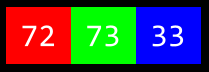

# Week 0 - Scratch

Week 0 is a introduction about some concept and notion really useful to know like what is binary, ASCII, hexadecimal, what is input output with example etc. This class of cs50 is more about course about computer programming, indeed, this class is about problem solving.

## Computer Science

* Essentialy, computer programming is babout taking some input and creating some output - thus solving a problem. What happens between the input and output, what we could call *a black box*, is the focus of this course.


### Numeral system

* For example, we may need to take attendance for a class. We could use a system called *unary system* to count, one finger at time. In *Unary Sytem*, each elements are represented by only one unit by only one symbol.
* If we want to know how many students are in a class, we can use the unary system to count them. With unary system, we count each unit with our fingers, each finger represent one unit. If we count to 5, we use 5 fingers, each finger representing one number. So, in our case, if we have 5 students in the class, we use 5 fingers.
* For computers today coubt using a system called *binary*. It's from the term *binary digit* that we get a fmailiar term called *bit*. A *bit* is a zero or one: **on** or **off**.
* Computers only speak in terms or zeros and ones. Zeros represent **off**. Ones represent **on**. Computers are millions, and perhaps billions, of transistors that are being turned on and off. Transistores is a semiconductor device used to amplify or switch electorinic signals and electrical power. There are located in the CPU, memory chips, and other integrated circuits.
* If you imagine using a light bulb, a single bulb can only count from zero to one.
* However if you were to have three light bulbs, there are more options open to you!
* Using light bulb could represent zero:
```
0 0 0
```
* Similary, the following would represent one:
```
0 0 1 
```
* By this logic, we could propose that the following equals two:
```
0 1 0
```
* Extending this logic furhter, the following represents three:
```
1 1 1
```
* Four would apear a:
```
1 0 0
```
* Five would apear a:
```
1 0 1
```
* Six:
```
1 1 0
```
* Seven:
```
1 1 1
```
* Why we have this result ? because, as a heuristic, we could imagine that the following values represent each possible place in ou *binary digit*:
```
4 2 1
```
* Computers use base-2 to count. This can be pictured as follows:
```
2^2		2^1		2^0
4		2		1
```
* Therefore, you could say that it would require three bits (the four's place, the two's place, and the one's place) to represent a number as high as seven.
* Computers generally use eight bits (also known as a *byte*) to represent a number. For example, 00000010 is the number 2 in *binary*, 00010101 is the number 21, 11111111 represent 255.


## ASCII

* Just as number are binary paterns of zero ones and zeros, letters are represented using ones and zeros too !
* Since there is an overlap between the ones and zeros that represents numbers and letters, the *ASCII* standard was created to map specific letters to specific numbers.
* For instance, the letter A was declared to map the number 65. 01000001 represents the number 65 in binary.
* If you receveid a text message, the binary under that message might represent the number 72, 73 and 33. Mapping theses out to ASCII, your message would look as follows:
```
H	I	!
72	73	33
```
* Thank goodness for standars like ASCII that allows us to agree upon these values !
* Here is an expanded map of ASCII values:

* Since binary can only count up to 255 we are limited to the number of characters represented by ASCII
 
## Unicode 

* As time has rolled on, there are more and more ways to communicate via text
* Since there were not enough digits in binary to represent all the various characters that could be represented by humans, the *Unicode* standard expanded the number of bits that can be transmitted and understood by computers. Unicode includes not only special characters, but emoji as well
* THere are emoji that you probabbly use everiday, the following may look familiar to you:

* Computer scientist faced a challenge when wanting to assign various skin tones to each emoji to allow the communication to be futrher personalized. In this case, the creators and contributors of emoji decied that the initial bits would be the structure of the emji itself, followed by skin tone.
* For example, the unicode for a generic thumbs up is ``U+1F44D``. However, the following represents the same thumbs up with a different skin tone: ``U+1F44D U+1F3FD``.
* More and more features are being added to the Unicode standard to represent further characters and emoji.

## Representation

* Zero and ones can be used to represent color
* Red, green, and blue (called RGB) is a combination of three numbers

* Taking our previously used 72, 73 and 33 (in ASCII section), wich said HI ! via text, would be interpreted by image renders as a light shade of yellow. The red value would be 72, the green value would ne 73, and the blue would be 33

* Further, zeros and ones can be used to represent images, videos, and music !
* Images are simply collections of RGB values
* Videos are sequences of many images that are stored together, just like aflipbook
* Music can be represented through MIDI data (Musical Instrument Digital Interface).

## Algorithms

* Problem-solving is central to computer science and computer programming 
* Imgaine the basic problem of trying to locate a single name in a phone book
* How many might you go about this ?
* One approach could be to simply read from page one to next to the next until reaching the last page
* Another approach could be to search two page at a time
* A final and perhaps better approach could be to go to the middle of the phone book and ask, "Is the name I a m looking for to the left or to the right ?" Then, repeat this process, cutting the problem in half and half
* Each of this approaches could be called algorithms. The speed of each of these algorithms can be pictured as follows in what is called *big-O notation:*

Notice that the first algorithm, highlited in red, has a big-O of n because if there are 100 names in the phone book, it could take up to 100 tries to find the correct name. The second algortihm, where two pages were searched at a time, has a big-O of 'n/2' because we searched twice as fast through the pages. The final algorithm as a big-O of log2n as doubling the problem would only result in one more step to solve the problem

## Pseudocode

* The ability to create *pseudocode* is central to one's success in both this class and in computer programming
* Pseudocode is a human-readable version of your code. For example, considering the third algortihm above, we coould compose pseudocode as follows:
```
1 Pick up phone book
2 Open to middle of phone book
3 Look at page
4 If person is on page
5	Call person
6 Else if person is earlier in book
7	Open to middle of left half of book
8	Go back to line 3
9 Else if person is later in book
10	Open to middle of right half of book
11	Go back to line 3
12 Else 
13	Quit
```
* Pseudocoding is such an important skill for at least two reasons. First, when you pseudocode before you create formal code, it allows you to tohink through the logic of your problem in advance. Secoind, when you pseudocode, you can later provide this information to others that are seeking to understand your coding decisions and how your code works
* Notice that the language within our pseudocode has come unique features. FIrst, some of these begin with verbs like *pick up, open, look at* Later, we will call these *functions*
* Second, notice that some line includes statements like ``if`` or ``else if``. These are called conditionals.
* Third, notice how there are expressions that can be stated as *true* or *false*, such as "person is earlier in the book". We call these *boolean expressions*
* Finally, notice how thses statements like "go back to line 3". We call these *loops*
Thses building blocks are the funcdamentals of programming
* In the context of *Scratch*, which is discusses below, we will use each of the above basic building blocks of programming
