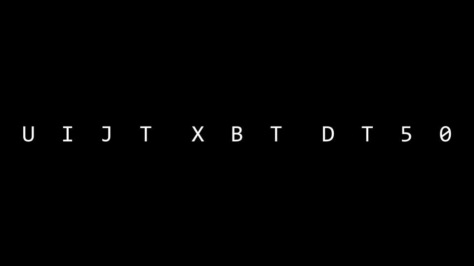
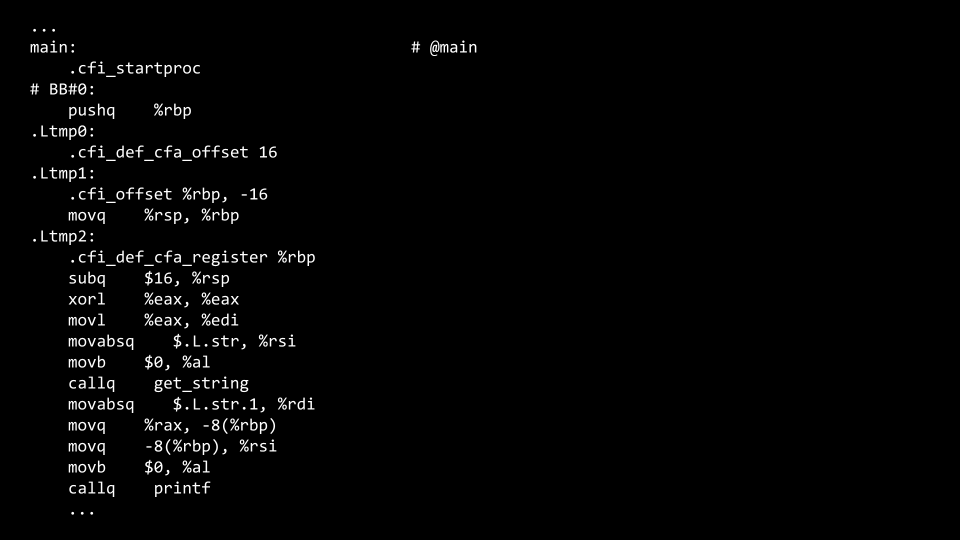
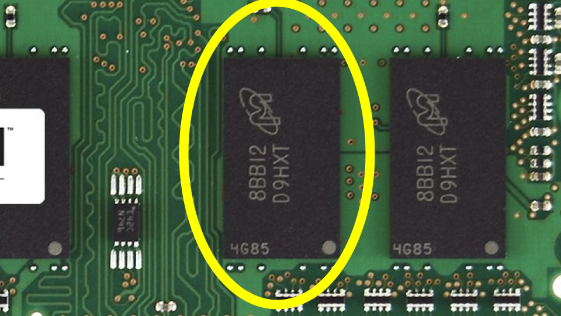
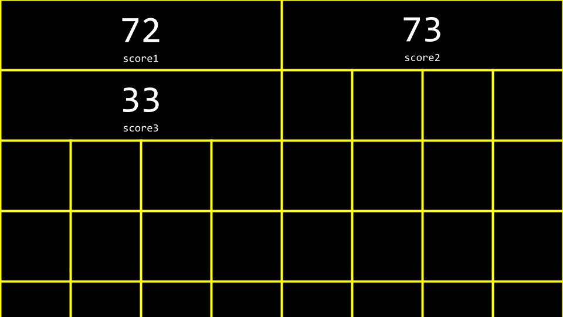
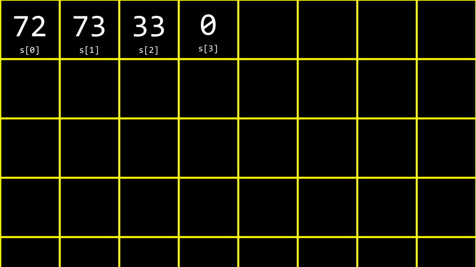

# Arrays 

## Welcome!

* In our previous session, we learned about C, a text based programming language.
* This week, we are going to take a deeper look at additional building-blocks that will support our goals of learning more about programming from the bottom-up.
* Fundamentally, in addition to the essentials of programming, this course is about problem solving. Accordingly, we will also focus further on how to approach computer science problems.

### Compiling 

* ***Encryption*** is the act of hiding plain text from prying eyes. ***decrypting***, then, is the act of taking an encrypted piece of text and returning to a human-readable form.
* An encrypted piece of text may look like the following:


* Recall that last week you learned about a ***compiler***, a specialized computer program that converts ***source code*** into ***machine code*** that can be understand by a computer.
* For example, you might have a computer program that looks like this:
```C  
#include <stdio.h> 

int main(void)
{
  printf("hello, world\n");
}
```
* A compiler will take the above code and turn it into following machine code:


* ***VS Code***, the programming environment utilizes a compiler called `clang` or `c language`
* If you were to type `make hello`, it runs a command that executes clang to create an output file that you can run as a user.
* VS Code has been pre-programmed such that `make` will run numerous command line arguments along with clang for you convenience as a user.
* Consider the following code:
```C 
#include <stdio.h>
#include <cs50.h>

int main(void){
  string name = get_string("What's your name ?");
  printf("hello, %s\n", name);
}
```
* You can attempt to enter into the terminal window: `clang -o hello hello.c`. You will be met by an error that indicates that clang does not know where to find the `cs50.h` library.
* Attempting again to compile this code, run the following command in the terminal: `clang -o hello hello.c -lcs50`. This will enable the compiler to access the `cs50.h` library.
* Running in the terminal window `./hello`, your program will run as intended.
* While the above is offered as an illustration, such that you can understand more deeply the process and concept of compiling code, using `make` in CS50 perfectly fine and the expectation!
* Compiling involves major steps, including the following:
  * First, ***preprocessing*** is where the header files in your code, designated by a `#`(such as `#include <cs50.h>`) are effectively copied and pasted into your file. During this step, the code from `cs50.h` is copied into your program. Similarly, just as your code contains `#include <stdio.h>`, code contained within `stdio.h` somewhere on your computer is copied to your program. This step can be visualized as follows:
  ```C 
  string get_string(string prompt);
  int printf(string format, ...);

  int main(void)
  {
    string name = get_stirng("What's your name ? ");
    printf("hello, %s\n", name);
  }
  ```
  * Second, ***compiling*** is where your program is converted into assembly code. This step can be visualized as follows:

  
  * Third, ***assembling*** involves the compiler converting your assembly code into machine code. This step can be visualized as follows:

  
  * Finally, during the ***linking*** step, code from your included libraries are converted also into machine code and combined with your code. The final executable file is then outputted.

  

## Debugging 

* Everyone will make mistakes while coding.
* Consider the following image from last week:


* Further, consider the following code that has a bug purposely inserted within it:
```C 
#include <stdio.h>

int main(void)
{
  for(int i = 0; i <= 3; i++)
  {
    printf("#\n");
  }
}
```
* Running this code, four bricks appear instead of the intended three.
* `printf` is a very useful way of debugging your code. You could modify your code as follows:
```C 
#include <stdio.h>

int main(void){
  for(int i = 0; i <= 3; i++)
  {
    printf("i is %d\n", i);
    printf("#\n");
  }
}
```
* Running this code, you will see numerous statements, including `i is 0`, `i is 2`, and `i is 3`. Seeing this, you might realize that Further code needs to be corrected as follows:
```C 
#include <stdio.h>

int main(void){
  for(int i = 0; i < 3; i++)
  {
    printf("#\n");
  }
}
```
Notice the `<=` has been replaced with `<`.
* This code can be further improved as follows:

```C 
#include <stdio.h>
#include <cs50.h>
void print_column(int height);

int main(void)
{
  int h = get_int("Height: ");
  print_column(h);

}

void print_column(int height){
  for (int i = 0; i <= height; i++) {
    printf("#\n");
  }
}

```
Notice that compiling and running this code still results in a bug.
* To address this bug, we will use a new tool at our disposal.
* A second tool in debugging is called a ***debugger***, a software tool created by programmers to help track down bugs in code.
* In VS Code, a preconfigured debugger has been provided to you.
* To utilize this debugger, first set a ***breakpoint*** by clicking to the left of a line of your code, just to the left of the line number. When you click here, you will see a red dot appearing. Imagine this as a stop sign, asking the compiler to pause such that you can consider what's happening in this part of your code.


* Second, run `debug50 ./buggy0`. You will notice that after the debugger comes to life that a line of code will illuminate in a gold-like color. Quite literally, the code has ***paused*** at this line of code. Notice in the top of your window, you can click the `step over` button and it will keep moving through your code. Notice how the value of `h` increases.
* While this tool will not show you where your bug is, it will help you slow down and see how your code is running step by step. You can use `step into` as a way to look further into the details of your buggy code.
* A final form of debugging is called ***rubber duck debugging***. When you are having challenges with your code, consider how speaking out loud to, quite literally, a rubber duck about the code problem. If you'd rather not talk to a small plastic duck, you are welcome to speak to a human near you! They need not understand how to program: Speaking with them is an opportunity for you to speak about your code.

## Arrays 

* In Week 0, we talked about ***data types*** such as `bool`, `int`.`char`, `sting`, etc.
* Each data type requires a certain amount of system ressources:
  * `bool` 1 byte
  * `int` 4 bytes
  * `long` 8 bytes
  * `float` 4 bytes
  * `double` 8 bytes
  * `char` 1 byte
  * `string` ? bytes
* Inside of your computer, you have a finite amount of memory available.



* Physically, on the memory of your computer, you can imagine how specific types of data are stored on your computer. You might imagine that a `char`, which only requires 1 byte of memory, may look as follows:


* Similarly, an `int` which requires 4 bytes might look as follows:


* We can create aprogram that explore these concepts. Inside your terminal, type `code scores.c` and write code as follows:
```C 
#include <stdio.h>

int main(void)
{
  //scrores
  int score1 = 72;
  int score2 = 73;
  int socre3 = 33;
  
  //printf average
  printf("Average: %f\n", (score1 + score2 + score3) / 3.0);
  
}
```
Notice that the number on the right is a floating point value of `3.0` such that the calculation as a floating point value in the end.

* Running `make scores`, the program runs.
* You can imagine how these variables are stored in memory:



* ***Arrays*** are a way of storing data back-to-back in memory such that this data is easily accesible.
* `int scores[3]`  is a way of telling the compiler to provide you three back-to-back places in memory of size `int` to store three `scores`. Considering our program, you can revise your code as follows:
```C 
#include <stdio.h>
#include <cs50.h>

int main(void){
  //get scores
  int scores[3];
  scores[0] = get_int("Score: ");
  scores[1] = get_int("Score: ");
  scores[2] = get_int("Score: ");

  //print average 
  printf("Average: %f\n: ",(scores[0] + scores[1] + scores[2]) / 3.0 );
}
```
Notice that `scores[0]` examines the value at this location of memory by `indexing into` the arrays called `scores` at location `0` to see what value is stored there.
* You can see how while the above code works, there is still an opportunity for improving our code. Revise your code as follows:
```C 
#include <stdio.h>
#include <cs50.h>

int main(void)
{
  //Get scores
  int scores[3];
  for(int i = 0; i < 3; i++)
  {
    scores[i] = get_int("Score: ");
  }

  //print average
  printf("Average: %f\n", (scores[0] + scores[1] + scores[2]) / 3.0);
}
```
Notice how we index into `scores` by using `scores[i]` where `i` is supplied by the `for` loop.
* We can simplify of `abstract away` the calculation of the average. Modify your code as follows:
```C  
#include <stdio.h>
#include <cs50.h>

//Constant
const int N = 3;

//Prototype
float get_average(int length, int array[]);

int main(void)
{
  int scores[N];
  for (int i = 0; i < N; i++) {
    scores[i] = get_int("Score: ");
  }
  float average = get_average(N, scores);
  printf("Average: %f\n", average);
  
}

float get_average(int length, int array[]){
  //Calculate the average
  int sum = 0;
  for(int i = 0; i < length; i++)
  {
    sum += array[i];
  }

  return sum / length;
}
```
Notice that a new function called `get_average` is declared,. Further, notice that a `const` or constant value of `N` is declared. Most importantly, notice how the `get_average` function takes `int array[]`, which means that the compiler passes an array to this function.
* Not only can arrays be containers: They can be passed between functions.

## Strings

 * A `string ` i simply an array of type `char`, an array of character.
 * Considering the following image, you can see how a string is an array of characters that begins with the first character and ends with a special character called `NUL charachter`:

* Imagine this in decimal, your array would look like the following:

* Implementing this in your own code, type `code hi.c` in the terminal window and write code as follows:
```C 
#include <stdio.h>

int main(void)
{
  char c1 = 'H';
  char c2 = 'I':
  char c3 = '!';
  
  printf("%c%c%c\n", c1, c2, c3);
}
```
Output:
```
HI!
```
Notice that this will output a string of characters.
* Similarly, make the following modification to your code:

```C 
#include <stdio.h>

int main(void)
{
  char c1 = 'H';
  char c2 = 'I':
  char c3 = '!';
  
  printf("%i %i %i\n", c1, c2, c3);
}
```
Output:
```
72 73 33
```
Notice that is ASCII codes are printed by replacing `%c` with `%i`.
* To further understand how a `strig` works, revise your code as follows:
```C 
#include <stdio.h>
#include <cs50.h>

int main(void)
{
  string s = "HI!";

  printf("%c%c%c\n", s[0], s[1], s[2]);

}
```
Output:
```
HI!
```
Notice how the `printf` statement presents three values for our array called `s`.
* As before, we can replace `%c` by `%i` as follows:

```C 
#include <stdio.h>
#include <cs50.h>

int main(void)
{
  string s = "HI!";

  printf("%i %i %i\n", s[0], s[1], s[2]);

}
```
Output:
```
72 73 33
```
Notice that this prints the string's ASCII codes, including NUL.
* Let's imagine we want to say both `HI!` and `BYE!`. Modify your code as follows:

```C 
#include <stdio.h>
#include <cs50.h>

int main(void)
{
  string s = "HI!";
  string t = "BYE!";
  printf("%s\n", s);
  printf("%s\n", t);

}
```
Output:
```
HI!
BYE!

```
Notice that two strings are declared and used in this example.
* You can visualize this as follow:

* We can further improve this code. Modify your code as follows:
```C 
#include <cs50.h>
#include <stdio.h>

int main(void){
  string words[2];

  words[0] = "HI!";
  words[1] = "BYE!";

  printf("%s\n", words[0]);
  printf("%s\n", words[1]);
}
```
Notice that both strings are stored within a single array of type `string`.

## String Length 

* A common problem within programming, and perhaps C more specifically, is to discover the length of an array. How could we implement this in code ? Type `code length.c` in the terminal window and code as follows:
```C 
#include <stdio.h>
#include <cs50.h>

int main(void)
{
  //Prompt for user's name 
  string name = get_string("Name: ");

  //Count number of characters up until `\0` (aka NUL)
  int n = 0;
  while (name[n] != '\0') {
    n++;
  }
  printf("%i\n", n);
}
```
Notice that this code loops until the `NUL` character is found.
* This code can be improved by abstracting away the counting as follows:
```C 
#include <stdio.h>
#include <cs50.h>

int string_length(string s);

int main(void)
{
  //Prompt for user's name 
  string name = get_string("Name: ");

  int length = string_length(name);
  printf("%i\n", length);
}

int string_length(string s){
  //Count number of characters up until '\0' (aka NUL)
  int n = 0;
  while (s[n] != '\0') {
    n++;
  }
  return n;
}

```
* Since this is such a common problem within programming, other programmers have created code in the `string.h` library to find the length of a string. You can find the length of a string by modifying your code as follws:
```C 
#include <stdio.h>
#include <cs50.h>
#include <string.h>

int main(void)
{
  //Prompt for user's name 
  string name = get_string("Name: ");

  int length = strlen(name);
  printf("%i\n", length);
}
```
Notice that this code uses the `string.h` library, declared at the top of the file. Further, it uses a function from that library called `strlen`, which calculates the length of the string passed to it.
* `ctype.h` is another library that is quite useful. Imagine we wanted to create a program that converted all lowercase characters to uppercase ones. In the terminal window type `code uppercase.c` and write code as follows:
```C 
#include <stdio.h>
#include <cs50.h>
#include <string.h>

int main(void)
{
  //Prompt for user's name 
  string name = get_string("Name: ");

  int length = strlen(name);
  printf("%i\n", length);
}
```
Notice that this code ***iterates*** through each value in the string. The program looks at each character. If the character is lowercase, it subtract the value 32 from it to convert it to uppercase.
* Recalling our previous work from last week, you might remember this ASCII values chart:

* When a lowercase character has `32` subtracted from it, it results in an uppercase version of that same character.
* While the program does what we want, there is an easier way using the `ctype.h` library. Modify your program as follows:
```C 
#include <cs50.h>
#include <ctype.h>
#include <stdio.h>
#include <string.h>

int main(void)
{
  string s = get_string("Before: ");
  printf("After: ");

  for(int i =0, n = strlen(s); i < n; i++){
    if(islower(s[i])){
      printf("%c",toupper(s[i]));
    }else {
      printf("%c", s[i]);
    }
  }
  printf("\n");
}
```
Notice that the program iterates through each character of the string. The `toupper` function is passed `s[i]`. Each character (if lowercase) is converted to uppercase.
* It's worth mentioning that `toupper` automatically knows to uppercase only lowercase characters. Hence, your code can be simplified as follows:
```C 
#include <cs50.h>
#include <ctype.h>
#include <stdio.h>
#include <string.h>

int main(void)
{
  string s = get_string("Before: ");
  printf("After: ");

  for(int i =0, n = strlen(s); i < n; i++){
    printf("%c",toupper(s[i]));
  }
  printf("\n");
}
```
Notice that this code uppercase a string using the `ctype` library.
* You can read about all the capabilities of the `ctype` library on the [Manual Pages](https://manual.cs50.io/#ctype.h)

## Command-line Arguments 

* `Command-line arguments`  are those arguments that are passed to your program at the command line. For example, all those statements you typed after `clang` are considered command line arguments. You can use these arguments in your own programs!
* I your terminal window, type `code greet.c` and write code as follows:
```C 
#include <stdio.h>
#include <cs50.h>

int main(void)
{
  string answer = get_string("What's your name ? ");

  printf("Hello %s\n", answer);
}

```
Notice that this says `hello` to the user.
* Still, would it not be nice to be able to take arguments before the program even runs ? Modify your code as folows:
```C 
#include <stdio.h>
#include <cs50.h>

int main(int argc, string argv[])
{
  if(argc == 2){
    printf("Hello %s\n", argv[1]);
  }else {
    printf("Hello, world\n");
  }
}
```
Output:
```
      ~/cs50/Week-2    main !2 ?3 ─────────────────────────────────────────────────────────────────────────────── 13:44:29  
❯ ./greet 
Hello, world

    ~/cs50/Week-2    main !2 ?3 ─────────────────────────────────────────────────────────────────────────────── 13:44:37  
❯ ./greet Lucalhost
Hello Lucalhost

```
Notice that this program knows bot `argc`, the number of command line arguments, and `argv` which is an array of the characters passed as arguments at the command line.
If we look what is on `argv[0]` we find the name of the executable file, in our case, is `./greet`, where is the one arguments command line `argc` equal to `1` if we just make the command `./greet` in the terminal window.
* Therefore, using the syntax of this program, executing `./greet David` would result int the program saying `Hello, David`.

## Cryptography

* Cryptography is the art of ciphering and deciphering a message
* `plaintext` and a `key` are provided to a `cipher`, resulting in a ciphered text.


* The key is a special arguments passed to the cipher along with the plaintext. The cipher uses the key to make decisions about how its cipher algorithm.

