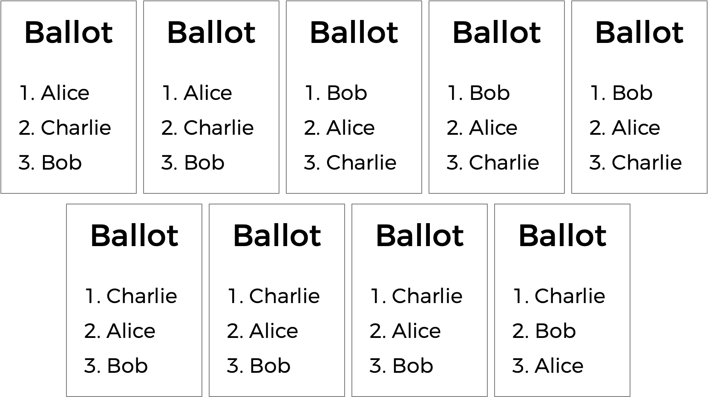

# Tideman

## Problem to solve

You already know about plurality elections, which follows very simple algorithm for determining the winner of an election:
every voter gets one vote does have some disadvantages. What happens, for instance, in an election with three candidates, and the ballots below are cast?

A plurality vote would here declare a tie between Alice and Bob, since each has two votes. But is that the right outcome?

There's another kind of voting system known as a ranked choice voting system. In a ranked choice system, voters can vote for more than one candidate. Instead of just voting for their top choice, they can rank the candidates in order of preference. The resulting ballots might therefore look like the below.

Here, each voter, in addition to specifying their first preference candidate, hs also indicated their second and third choices. And now, what was previously a tied election could now have a winner. The race was originally tied between ,Alice and Bob, so alice could here be declared the winner.

Ranked  choice voting can also solve yet another potential drawback of plurality voting. Take a look at the following ballots.

Who should win this election? In a plurality vote where each voter chooses their first preference only, Charlie wins this election with four votes compared to only three for Bob and two for Alice. (Note that, if you're familiar with the instant runoff voting system, Charlie wins here under that system as well). Alice, however, might reasonably make the argument that she should be the winner of the election instead of Charlie: after all, of the nine voters, a majority (five of them) preferred Alice over Charlie, so most people would be happier with Alice as the winner instead of Charlie.

Alice is, in this election, so-called "Condorcet winner" of the election: the person would have won any head-to-head matchup against another candidate. If the election had been just Alice and Bob, or just Alice and Charlie, Alice would have won.

The Tideman voting method (also known as "ranked pairs") is a ranked-choice voting method that's guaranteed to produce the Condorcet winner of the election if one exists. In a file called `tideman.c` in a folder called `tideman`, create a program to simulate an election by the Tideman voting method.
