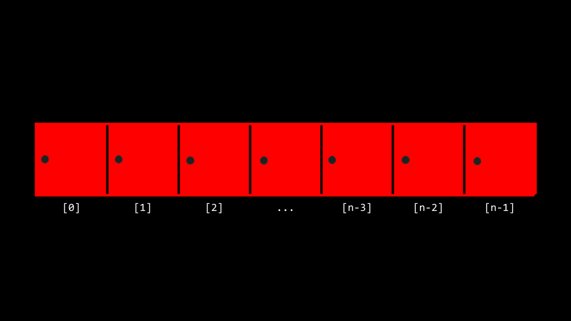

# Algorithms

## Welcome

* In week zero, we introduced the idea of an ***algorithm***: a black box that may take an input and creates an output.
* This week, we are going to expand our understanding of algorithms through pseudocode and into code itself.
* Also, we are going to consider the efficiency of these algorithms. Indeed, we are going to be building upon our understanding of how to use some of the ***lower-level*** concepts we discussed last week in building algorithms.
* Recall back to earlier in the course when we introduced the following graph:


* As we step into this week, you should consider how the way an algorithm works with a problem may determine the time it takes to solve a problem! Algorithms can be designed to be more and more efficient, to a limit.
* Today, we will focus upon the design of algorithms and how to measure their efficiency.

## Linear Search

* Recall that last week you were introduced to the idea of an ***array***, blocks of memory that are consecutive: Side-by-side with one another.
* You can metaphorically imagine an array like a series of seven red lockers as follows:


* We can imagine that we have an essential problem of wanting to know, "Is the number 50 inside an array?" A computer must look at each locker to be able to see if the number 50 is inside. We call this process of finding such a number, character, string, or other item ***searching***.
* We can potentially hand our array to an algorithm, wherein our algorithm will search through our lockers to see if the number 50 is behind one of the doors: Returning the value true or false.


* We can imagine various instructions we might provide our algorithm to undertake this task as follows:

```
For each door from left to right
  If 50 is behind door 
    Return true
Return false
```

Notice that the above instructions are called ***pseudocode***: A human-readable version of the instructions that we could provide the computer.

* A computer scientist could translate that pseudocode as follows:

```
For i from 0 to n-1 
  If 50 is behind the door[i]
    Return true
Return false
```

Notice that the above is still not code, but it is a pretty close approximation of what the final code might look like.

## Binary Search

* ***Binary Search*** is another ***search algorithm*** that could be employed in our tasks of finding the 50.
* Assuming that the values within the lockers have been arranged from smallest to largest, the pseudocode for binary search would appear as follows:

```
If no doors left
  Return false
If 50 is behind middle door
  Return true
Else if 50 < middle door
  Search left half
Else if 50 > middle door
  Search right half
```

* Using the nomenclature of code, we can further modify our algorithm as follows:

```
If no doors left  
  Return false
If 50 is behind doors[middle]
  Return true
Else if 50 < doors[middle]
  Search doors[0] through doors[middle - 1]
Else if 50 > doors[middle]
  Search doors[middle + 1] through doors[n -1]
```

Notice, looking at this approximation of code, you can nearly imagine what this might look like in actual code.

## Running Time

* ***Running time*** involves an analysis using ***big O*** notation. Take a look at the following graph:


* Rather than being ultra-specific about the mathematical efficiency of an algorithm, computer scientist discuss efficiency in terms of ***the order of*** various running times.
* In the above graph, the first algorithm is ***O(n)*** or ***in the order of n***. The second is in ***O(n)*** as well. The third is in ***O(log n)***.
* It's the shape of the curve that allows the efficiency of an algorithm. Some common running times we see are:
  * O(n^2)
  * O(n \log n)
  * O(n)
  * O(\log n)
  * O(1)
* Of the running times above, O(n^2) is considered the worst running time, O(1) is the fastest.
* Linear search was of order O(n) because it could take ***n*** steps in the worst case to run.
* Binary search was of order O(\log n) because it would take fewer and fewer steps to run even in the worst case.
* Programmers are interested in both the worst case, or ***upper bound***, and best case, or ***lower bound***.
* The \Omega symbol is used to denote the best case of an algorithm, such as \Omega(\log n).
* The \Theta symbol is used to denote where the upper bound and lower bound are the same, where the best case and the worst case running times are the same.
* As you continue to develop your knowledge in computer science, you will explore these topics in more detail in future courses.

## search.c

* You can implement linear search ourselves by typing `code search.c` in your terminal window and by writing code as follows:

```C
#include <cs50.h>
#include <stdio.h>

int main(void)
{
  //an array of integers
  int numbers[] = {20, 500, 10, 5, 100, 1, 50};

  //Search for number 
  int n = get_int("number: ") ;
  for (int i = 0; i < 7;i++) {
    if(numbers[i] == n){
      printf("Found\n");
      return 0;
    }
  }
  printf("Not found\n");
  return 1;
}
```

Notice that the line beginning with `int numbers[]` allows us to define the values of each element of the array as we create it. Then, in the `for` loop, we have an implementation of linear search. `return 0` is used to indicate success and exit the program. `return 1` is used to exit the program with an error (failure).

* We have now implement linear search ourselves in C!
* What if we wanted to search for a string within an array? Modify your code as follows:

```C
#include <cs50.h>
#include <stdio.h>
#include <string.h>

int main(void)
{
  //an array of strings
  string strings[] = {"battleships", "boot", "cannon","iron", "thimble", "top hat"};

  //Search for string 
  string s = get_string("String: ") ;
  for (int i = 0; i < 6;i++) {
    if(strcmp(strings[i], s)== 0){
      printf("Found\n");
      return 0;
    }
  }
  printf("Not found\n");
  return 1;
}

```

Notice that we cannot utilize `==` as in our previous iteration of this program. Instead, we use `strcmp`, which comes from the `string.h` library. `strcmp` will return `0` if the strings are the same.

* Indeed, running this code allows us to iterate over this array of strings to see if a certain string was within it. However, if you see a ***segmentation fault***, wheer a part of memory was touched by your program that it should not have access to, do make sure you have `i < 6` noted above istead of `i < 7`.
* We can combine these ideas of bothh numbers and strings into a single program. Type `code phonebook.c` into your terminal window and write code as follows:

```C

#include <cs50.h>
#include <stdio.h>
#include <string.h>

int main(void){
  //Arrrays of strings 
  string names[] = {"Carter", "David", "John"};
  string numbers[] = {"+1-617-4985-1000", "+1-617-495-1000", "+1-949-468-2750"};

  //Search for name
  string name = get_string("Name: ");

  for (int i = 0;i < 3; i++) {
    if(strcmp(names[i], name) == 0){
      printf("Found %s\n", numbers[i]);
      return 0;
    }
  }
  printf("Not found\n");
  return 1;
}
```

Notice that Carter's number begins with `+1-617`, David's phone number starts with `+1-617`. and John's number starts with `+1-949`. Therefore, `names[0]` is Carter and `numbers[0]` is Carter's number. This code will allow us to search the phonebook to for a person person's specific number.

* While this code works, there are numerous inefficiencies. Indeed, there is a chance that people's names and numbers may not correspond. Wouldn't be nice if we could create our own data type where we could associate a person with the phone number?

## Data Structure

* It turns out that C allows a way by which we can create our own data types via a `struct`.
* Would it not be useful to create our own data type called a `person`, that has inside of it a `name` and `number`.
* Modify your code as follows:

```C
#include <cs50.h>
#include <stdio.h>
#include <string.h>

typedef struct{
  string name;
  string number;
} Person;

int main(void){
  Person people[3];

  people[0].name = "Carter";
  people[0].number = "+1-617-4985-1000";

  people[1].name = "David";
  people[1].number = "+1-617-495-1000";

  people[2].name = "John";
  people[2].number = "+1-949-468-2750";

  //Search for name  
  string name = get_string("Name: ");
  for (int i = 0; i < 3; i++) {
    if(strcmp(people[i].name, name) == 0){
      printf("Found: %s\n", people[i].number);
      return 0;
    }
  }
  printf("Not found\n");
  return 1;
}
```

Notice that the code begins with `typedef struct` where a new datatype called `Person` is defined. Inside a `Person` is a string called `name` and a `string` called number. In the `main` function, begin by creating an array called `people` that is of type `Person` that is size of 3. Then, we update the names and phone numbers of the two people in our `people` array. Most important, notice how the ***dot notation*** such as `people[0].name` allows us to access the `Person` at the 0th location and assign that individual a name.

## Sorting

* ***Sorting*** is the act of taking an unsorted list of values and transforming this list into a sorted one.
* When a list is sorted, searching that list is a far less taxing on the computer. Recall that we can use binary search on a sorted list, but not on an unsrted one.
* It turns out that there are many different types of sorting algorithms.
* ***Selection sort*** is one such search algorithm.
* We can represent an array as follows:



* The algorithm for selection sort in pseudocode is:

```
For i from 0 to n-1 
  Find smallest number between numbers[i] and numbers[n-1]
  Swap smallest number with numbers[i]
```

* Summarizing those steps, the first time iterating the list took `n - 1` steps. The second time, it took `n - 2` steps. Carrying this logic forward, the steps required could be represented as follows:

```
(n - 1) + (n - 2) + (n -3) + ... + 1
```

* This could be simplified to n(n-1)/2 or, more simply, O(n^2).

## Bubble Sort

* ***Bubble sort*** is another sorting algorithm that works by repeatedly swapping elements to "bubble" larger elements to the end.
* The pseudocode for bubble sort is:

```
Repeat n-1 times 
  For i from 0 to n-2
    If numbers[i] and numbers[i+1] out of order
      Swap them
  If no swaps
    Quit
```

* As we further sort the array, we know more and more of it becomes sorted, so we only need to look at the pairs of numbers that haven't been sorted yet.
* Analyzing selection sort, we made only seven comparisons. Representing this mathematically, where ***n*** represents the number of cases, it could be said that selection sort can be analyzed as:

```
(n -1) + (n -2) + (n - 3) + ... + 1
```

or more simply n^2/2 - n/2.

* Considering that mathematical analysis, n^2 is really the most influential factor in determining the efficiency of this algorithm. Therefore, selection sort is considered to be of the order of O(n^2) in the worst case where all values are unsorted. Even when all values are sorted, it will take the same number of steps. Therefore, the best case can be noted as \Omega(n^2). Since both the upper bound and lower bound cases are the same, the efficiency of this algorithm as a whole can be regarded as \Theta(n^2).
* Analyzing bubble sort, the worst case is O(n^2). The best case is \Omega(n).
* You can [visualize](https://www.cs.usfca.edu/~galles/visualization/ComparisonSort.html) a comparison of these algorithms.

## Recursion

* How could we improve our efficiency in our sorting ?
* ***Recursion*** is a concept within programming where a function calls itself. We saw this earlier when we saw...

```
If no doors left
  Return false 
If number bihind middle door 
  Return true 
Else if number < middle door 
  Search left half 
Else if number > middle door 
  Search right half
```

Notice that we are calling `search` on smaller and smaller iterations of this problem.

* Similarly, in our pseudocode for Week 0, you can see where recursion was implemented:

```
1   Pick up phone book
2   Open to middle of phone book
3   Look at page
4   If person is on page 
5     Call person
6   Else if person is earlier in book
7     Open to middle of left half of book
8     Go back to line 3
9   Else if person is later in book
10    Open to middle of right half of book
11    Go back to line 3
12  Else 
13    Quit
```

* This code could have been simplified, to highlight its recursive properties as follows:

```
1   Pick up phone book
2   Open to middle of phone book
3   Look at page
4   If person is on page 
5     Call person
6   Else if person is earlier in book
7     Search left half of book
9   Else if person is later in book
10    search right half of book
12  Else 
13    Quit
```

* Consider how in Week 1 we wanted to create a pyramid structure as follows:

```
#
##
###
####
```

* To implement this using recursion, type `code recursion.c` into your terminal window and write code as follows:

```C
#include <stdio.h>
#include <cs50.h>

void draw(int n);

int main(void){
  draw(1);
  return 0;
}

void draw(int n){
  for (int i = 0; i < n; i++) {
    printf("#");
  }
  printf("\n");
  draw(n - 1);
}
```

Notice that the draw function calls itself. Further, note that your code may get caught in an infinite loop. To break from this loop, if you get stuck, hit `ctrl-c` on your keyboard. The reason this creates an infinite loop is that there is nothing telling the program to end. There is no case where the program is done.

* We can correct our code as follows:

```C
#include <stdio.h>
#include <cs50.h>
#include <stdlib.h>

void draw(int n);

int main(int argc, char *argv[]){
  if(argc != 2){
    printf("Usage: ./recursion n\n");
    return 1;
  }
  draw(atoi(argv[1]));
  return 0;
}

void draw(int n){
  //If nothing to draw
  if(n <= 0){
    return;
  }
  //Draw pyramid of height n - 1
  draw(n - 1);

  //Draw one more row of width n
  for (int i = 0; i < n; i++) {
    printf("#");
  }
  printf("\n");
}
```

Notice the ***base case*** will ensure the code does not run forever. The line `if (n <= 0)` terminates the recursion because the problem has been solved. Every time `draw` calls itself by `n-1`. At some point, `n-1` will equal `0`, resulting in the `draw` function returning and the program will end.
