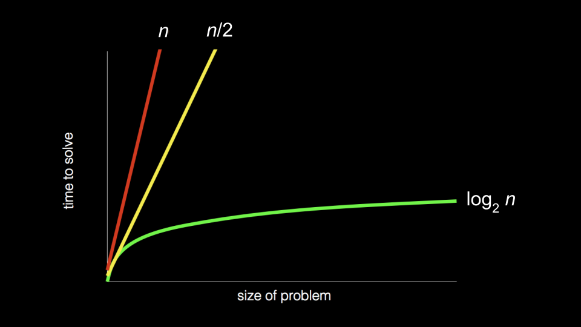
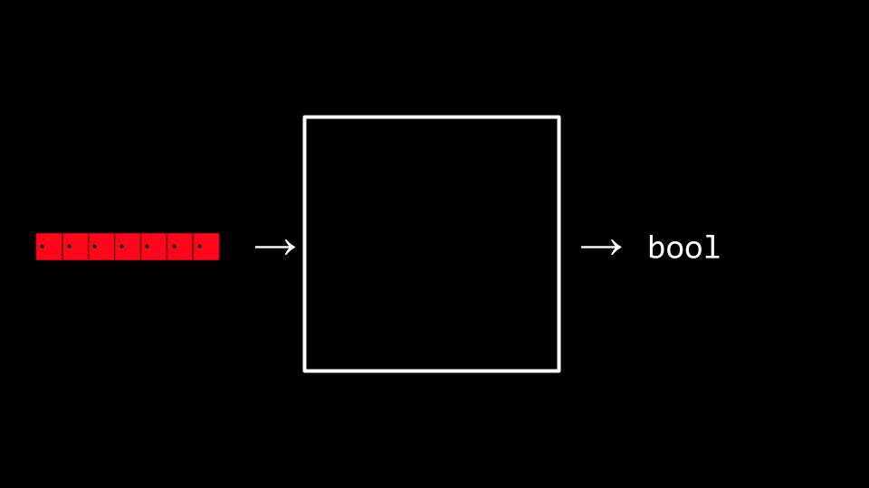

# Algorithms

## Welcome

* In week zero, we introduced the idea of an ***algorithm***: a black box that may take an input and creates an output.
* This week, we are going to expand our understanding of algorithms through pseudocode and into code itself.
* Also, we are going to consider the efficiency of these algorithms. Indeed, we are going to be building upon our understanding of how to use some of the ***lower-level*** concepts we discussed last week in building algorithms.
* Recall back to earlier in the course when we introduced the following graph:



* As we step into this week, you should consider how the way an algorithm works with a problem may determine the time it takes to solve a problem! Algorithms can be designed to be more and more efficient, to a limit.
* Today, we will focus upon the design of algorithms and how to measure their efficiency.

## Linear Search

* Recall that last week you were introduced to the idea of an ***array***, blocks of memory that are consecutive: Side-by-side with one another.
* You can metaphorically imagine an array like a series of seven red lockers as follows:


* We can imagine that we have an essential problem of wanting to know, "Is the number 50 inside an array?" A computer must look at each locker to be able to see if the number 50 is inside. We call this process of finding such a number, character, string, or other item ***searching***.
* We can potentially hand our array to an algorithm, wherein our algorithm will search through our lockers to see if the number 50 is behind one of the doors: Returning the value true or false.



* We can imagine various instructions we might provide our algorithm to undertake this task as follows:

```
For each door from left to right
  If 50 is behind door 
    Return true
Return false
```

Notice that the above instructions are called ***pseudocode***: A human-readable version of the instructions that we could provide the computer.

* A computer scientist could translate that pseudocode as follows:

```
For i from 0 to n-1 
  If 50 is behind the door[i]
    Return true
Return false
```

Notice that the above is still not code, but it is a pretty close approximation of what the final code might look like.

## Binary Search

* ***Binary Search*** is another ***search algorithm*** that could be employed in our tasks of finding the 50.
* Assuming that the values within the lockers have been arranged from smallest to largest, the pseudocode for binary search would appear as follows:

```
If no doors left
  Return false
If 50 is behind middle door
  Return true
Else if 50 < middle door
  Search left half
Else if 50 > middle door
  Search right half
```

* Using the nomenclature of code, we can further modify our algorithm as follows:

```
If no doors left  
  Return false
If 50 is behind doors[middle]
  Return true
Else if 50 < doors[middle]
  Search doors[0] through doors[middle - 1]
Else if 50 > doors[middle]
  Search doors[middle + 1] through doors[n -1]
```

Notice, looking at this approximation of code, you can nearly imagine what this might look like in actual code.

## Running Time

* ***Running time*** involves an analysis using ***big O*** notation. Take a look at the following graph:


* Rather than being ultra-specific about the mathematical efficiency of an algorithm, computer scientist discuss efficiency in terms of ***the order of*** various running times.
* In the above graph, the first algorithm is ***O(n)*** or ***in the order of n***. The second is in ***O(n)*** as well. The third is in ***O(log n)***.
* It's the shape of the curve that allows the efficiency of an algorithm. Some common running times we see are:
  * O(n^2)
  * O(n \log n)
  * O(n)
  * O(\log n)
  * O(1)
* Of the running times above, O(n^2) is considered the worst running time, O(1) is the fastest.
* Linear search was of order O(n) because it could take ***n*** steps in the worst case to run.
* Binary search was of order O(\log n) because it would take fewer and fewer steps to run even in the worst case.
* Programmers are interested in both the worst case, or ***upper bound***, and best case, or ***lower bound***.
* The \Omega symbol is used to denote the best case of an algorithm, such as \Omega(\log n).
* The \Theta symbol is used to denote where the upper bound and lower bound are the same, where the best case and the worst case running times are the same.
* As you continue to develop your knowledge in computer science, you will explore these topics in more detail in future courses.

## search.c

* You can implement linear search ourselves by typing `code search.c` in your terminal window and by writning code as follows:

```C
#include <cs50.h>
#include <stdio.h>

int main(void)
{
  //an array of integers
  int numbers[] = {20, 500, 10, 5, 100, 1, 50};

  //Search for number 
  int n = get_int("number: ") ;
  for (int i = 0; i < 7;i++) {
    if(numbers[i] == n){
      printf("Found\n");
      return 0;
    }
  }
  printf("Not found\n");
  return 1;
}
```

Notice that the line beginning with `int numbers[]` allows us to define the values of each element of the array as we create it. Then, in the `for` loop, we have an implementation of linear search. `return 0` is used to indicate success and exit the program. `return 1` is used to exit the program with an error (failure).

* We have now implement linear search ourselves in C!
* What if we wanted to search for a string within an array? Modify your code as follows:

```C
#include <cs50.h>
#include <stdio.h>
#include <string.h>

int main(void)
{
  //an array of strings
  string strings[] = {"battleships", "boot", "cannon","iron", "thimble", "top hat"};

  //Search for string 
  string s = get_string("String: ") ;
  for (int i = 0; i < 6;i++) {
    if(strcmp(strings[i], s)== 0){
      printf("Found\n");
      return 0;
    }
  }
  printf("Not found\n");
  return 1;
}

```

Notice that we cannot utilize `==` as in our previous iteration of this program. Instead, we use `strcmp`, which comes from the `string.h` library. `strcmp` will return `0` if the strings are the same.

* Indeed, running this code allows us to iterate over this array of strings to see if a certain string was within it. However, if you see a ***segmentation fault***, wheer a part of memory was touched by your program that it should not have access to, do make sure you have `i < 6` noted above istead of `i < 7`.
* We can combine these ideas of bothh numbers and strings into a single program. Type `code phonebook.c` into your terminal window and write code as follows:

```C

#include <cs50.h>
#include <stdio.h>
#include <string.h>

int main(void){
  //Arrrays of strings 
  string names[] = {"Carter", "David", "John"};
  string numbers[] = {"+1-617-4985-1000", "+1-617-495-1000", "+1-949-468-2750"};

  //Search for name
  string name = get_string("Name: ");

  for (int i = 0;i < 3; i++) {
    if(strcmp(names[i], name) == 0){
      printf("Found %s\n", numbers[i]);
      return 0;
    }
  }
  printf("Not found\n");
  return 1;
}
```

Notice that Carter's number begins with `+1-617`, David's phone number starts with `+1-617`. and John's number starts with `+1-949`. Therefore, `names[0]` is Carter and `numbers[0]` is Carter's number. This code will allow us to search the phonebook to for a person person's specific number.

* While this code works, there are numerous inefficiencies. Indeed, there is a chance that people's names and numbers may not correspond. Wouldn't be nice if we could create our own data type where we could associate a person with the phone number?

## Data Structure

* It turns out that C allows a way by which we can create our own data types via a `struct`.
* Would it not be useful to create our own data type called a `person`, that has inside of it a `name` and `number`.
* Modify your code as follows:

```C
#include <cs50.h>
#include <stdio.h>
#include <string.h>

typedef struct{
  string name;
  string number;
} Person;

int main(void){
  Person people[3];

  people[0].name = "Carter";
  people[0].number = "+1-617-4985-1000";

  people[1].name = "David";
  people[1].number = "+1-617-495-1000";

  people[2].name = "John";
  people[2].number = "+1-949-468-2750";

  //Search for name  
  string name = get_string("Name: ");
  for (int i = 0; i < 3; i++) {
    if(strcmp(people[i].name, name) == 0){
      printf("Found: %s\n", people[i].number);
      return 0;
    }
  }
  printf("Not found\n");
  return 1;
}
```

Notice that the code begins with `typedef struct` where a new datatype called `Person` is defined. Inside a `Person` is a string called `name` and a `string` called number. In the `main` function, begin by creating an array called `people` that is of type `Person` that is size of 3. Then, we update the names and phone numbers of the two people in our `people` array. Most important, notice how the ***dot notation*** such as `people[0].name` allows us to access the `Person` at the 0th location and assign that individual a name.
