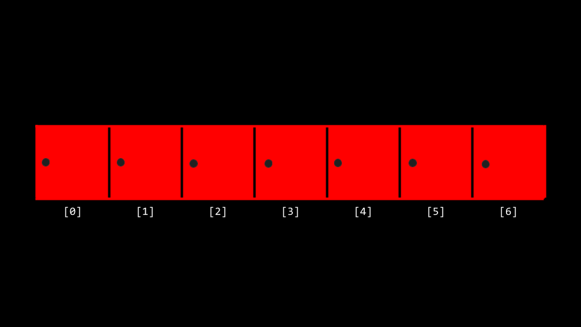

# Algorithms

## Welcome

* In week zero, we introduced the idea of an ***algorithm***: a black box that may take an input and creates an output.
* This week, we are going to expand our understanding of algorithms through pseudocode and into code itself.
* Also, we are going to consider the efficiency of these algorithms. Indeed, we are going to be building upon our understanding of how to use some of the ***lower-level*** concepts we discussed last week in building algorithms.
* Recall back to earlier in the course when we introduced the following graph:


* As we step into this week, you should consider how the way an algorithm works with a problem may determine the time it takes to solve a problem! Algorithms can be designed to be more and more efficient, to a limit.
* Today, we will focus upon the design of algorithms and how to measure their efficiency.

## Linear Search

* Recall that last week you were introduced to the idea of an ***array***, blocks of memory that are consecutive: Side-by-side with one another.
* You can metaphorically imagine an array like a series of seven red lockers as follows:



* We can imagine that we have an essential problem of wanting to know, "Is the number 50 inside an array?" A computer must look at each locker to be able to see if the number 50 is inside. We call this process of finding such a number, character, string, or other item ***searching***.
* We can potentially hand our array to an algorithm, wherein our algorithm will search through our lockers to see if the number 50 is behind one of the doors: Returning the value true or false.


* We can imagine various instructions we might provide our algorithm to undertake this task as follows:

```
For each door from left to right
  If 50 is behind door 
    Return true
Return false
```

Notice that the above instructions are called ***pseudocode***: A human-readable version of the instructions that we could provide the computer.

* A computer scientist could translate that pseudocode as follows:

```
For i from 0 to n-1 
  If 50 is behind the door[i]
    Return true
Return false
```

Notice that the above is still not code, but it is a pretty close approximation of what the final code might look like.
