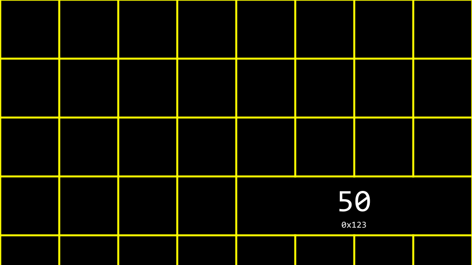

# Memory

* [Welcome!](#welcome)
* [Pixel Art](#pixel-art)
* [Hexadecimal](#hexadecimal)
* [Memory](#memory)
* [Pointers](#pointers)
* [Strings](#strings)
* [Pointer Arithmetic](#pointer-arithmetic)
* [String Comparison](#string-comparison)
* [Copying](#copying)
* [malloc and Valgrind](#malloc-and-valgrind)
* [Garbage Values](#garbage-values)
* [Pointer Fun with Binky](#pointer-fun-with-binky)
* [Swap](#swap)
* [Overflow](#overflow)
* [scanf](#scanf)
* [File I/O](#file-i/o)
* [Summing Up](#summing-up)

## Welcome

* In previous weeks, we talked about images being made of smaller buidling blocks called pixels.
* Today, we will go into further detail about the zeros and ones that make up these images. In particular, we will be going deeper inotu the fundamental building blocks that make up files, including images.
* Further, we will discuss how to access the underlying data stored in computer memory.

## Pixel Art

* Pixels are squares, individual dots, of color that are arranged on an up-down, left-right grid.
* You can imagine as an image as a map of bits, where zeros represent black and ones represent white.


* ***RBG***, or ***red***, ***green***, ***blue***, are numbers that represent the amount of each of these colors. In Adobe Photoshop, you can see thses settings as follows:


Notice how the amount of red, blue, and green changes the color selected.

* You can see by the image above that color is not just represented in three values. At the bottom oof the window, there is a special value made up of numbers and characters. 255 is represented as FF. Why might this be ?

## Hexadecimal

* ***Hexadecimal*** is a system of counting that has 16 counting values. They are as follows:
`0 1 2 3 4 5 6 7 8 9 a b c d e f`
Notice that F represents 15.
* Hexadecimal is also known as ***base-16***
* When counting in hexadecimal, each column is a power of 16.
* The number 0 is represented as `00`
* The number 1 is represented as `01`
* The number 9 is represented as `09`
* The number 10 is represented as `0A`
* The number 15 is represented as `0F`
* The number 16 is represented as `10`
* The number 2555 is represented as FF, because 16 X 15 (or F) is 240. Add 15 more to make 255. This is the highest number you can count using a two-digit hexadecimal system.
* Hexadecimal is useful because it can be represented using fewer digits. Hexadecimal allows us to represent information more succinctly.

## Memory

* In weeks past, you may recall out artist rendering of concurrent blocks of memory. Applying hexadecimal numbering to each of these blocks of memory, you can visualize these as follows:


* You can imagine how there may be confusion regarding whether the `10` block above may represent a location in memory or the value `10`. Accordingly, by convention, all hexadecimal numbers are often represented with the `0x` prefix as follows:


* In your terminal window, type `code addresse.c` and write your code as follows:

```C
#include <stdio.h>

int main(void)
{
    int n = 50;
    printf("%i\n", n);
}
```

Notice how `n`is stored in memory with the value 50.

* You can visualize how program stores this value as follows:



* The C language has two powerful operators that relate to memory:
`&` Prodide the address of something stored in memory.
`*` Instructs the compiler to go to a location in memory.
* We can leverage this knowledge by modifying our code as follws:

```C
#include <stdio.h>

int main(void)
{
    int n = 50;
    printf("%p\n", &n);
}
```

Notice how the `%p`, which allows us to view the address of a location in memory. `&n` can be literraly translated as "the address of `n`". Executing this code will return an address of memory beggining with `0x`.
Output:

```zsh
./addresses  
0x16ae7ef7c

```

## Pointers

* A ***pointer*** is a variable that contains the address of some value. Most succinctly, a pointer is an address in your computer's memory.
* Consider the following code:

```C
int n = 50;
int *p = &n;
```

Notice that `p` is a pointer that contains the address of an integer `n`.

* Modify your code as follows:

```C
#include <stdio.h>

int main(void)
{
    int n = 50;
    int *p = &n;
    printf("%p\n", p);
}
```

Notice that this code has the same effect as our previous code. We have simply leveragged our new knowledge of the `&` and `*` operators.

* To illustrate the use of the `*` operator, consider the following:

```C
#include <stdio.h>

int main(void)
{
    int n = 50;
    int *p = &n;
    printf("%i\n", *p);
}
```

Notice that the `printf` line prints the integer at the location of `p`. `int *p` creates a pointer whose job is to store the memory address of an integer.

* You can visualize our code as follows:


Notice the pointer seems rather large. Indeed, a pointer is usually stored as `8-byte value`. `p` is storing the address of the `50`.

* You can more accurately visualize a pointer as one address that points to another:


## Strings

* Now that we have a mental model for pointers, we can peel back a level of simplification that was offered earlier in this course.
* Recall taht a string is simply an array of characters. For example, `string s  = "HI!` can be represented as follwos;


* However, what is `s` really ? Where is the `s` stored in memory ? As you can imagine, `s` needs to be stored somewhere. You can visualize the relationship of `s` to the string as follows:


Notice how a pointer called `s` tells thje compiler where the first byte of the string exists in memory.

* Modify your code as follows:

```C
#include <cs50.h>
#include <stdio.h>

int main(void)
{
    string s = "HI!";
    printf("%p\n", s);
    printf("%p\n", &s[0]);
    printf("%p\n", &s[1]);
    printf("%p\n", &s[2]);
    printf("%p\n", &s[3]);
}
```

Notice the above prints the memory locations of each character in the string `s`. The symbol is used to show the address of each element of the string. When running this code, notice that elements `0, 1, 2, 3` are next to one another in memory.

* Likewise, you can modify your code as follows:

```C
#include <stdio.h>

int main(void)
{
    char *s = "HI!";
    printf("%s\n", s);
}
```

Notice that this code will present the string that starts at the location of `s`. This code effectively removes the training wheels of the `string` data type offered by `cs50.h`. This is raw C code, without the scaffolding of thje cs50 library.

* You can imagine how a string, as a data type, is created.
* Last week, we learned how to create your own data type as a struct.
* The `cs50` library includes a struct as follows: `typedef char *string`.
* This `struct`, when using the `cs50` library, allows one to use a custom data tye called `string`.

## Pointer Arithmetic

* You can modify your code to accomplish the same thing in a longer form as follows:

```C  
#include <stdio.h>

int main(void)
{
    char *s = "HI!";
    printf("%c\n", s[0]);
    printf("%c\n", s[1]);
    printf("%c\n", s[2]);
}
```

Notice that we are printing each character at the location of `s`.

* Further, you can modify your code as follows:

```C
#include <stdio.h>

int main(void)
{
    char *s = "HI!":
    printf("%c\n", *s);
    printf("%c\n", *(s + 1));
    printf("%c\n", *(s + 2));
}
```

Notice that the first character at the location of `s` is printed. Then, the character at the location `s + 1` is printed, and so on.

## String Comparison

* A string of characters is simply an array of characters identified by its first byte.
* Earlier in the course, we considred te comparison of integers. We could represent this in code by typing code `compare.c` into the terminal window and writing code as follows:

```C
#include <cs50.h>
#include <stdio.h>

int main(void)
{
    //Get two integer 
    int i = get_int("i: ");
    int j = get_int("j: ");

    //Compare integers
    if(i == j)
    {
        printf("Same\n");
    }
    else
    {
        printf("Different\n");

    }
}
```

Notice that this code takes two integers from the user and compares them.

* In the case of strings, however, one cannot compare two strings using the == operator.
* Utilizing the == operator in an attempt to compare strings will attempt to compare the memory locations of the string instead of the characters therin. Accordingly, we reommencded the use of `strcmp`.
* To illustrate this, modify your code as follows:

```C
#include <cs50.h>
#include <stdio.h>

int main(void)
{
    char *s = get_string("s: ");
    char *t = get_string("t: ");

    if(s == t)
    {
        printf("Same\n");
    }
    else
    {
        printf("Different\n");

    }
}

```

Output:

```
❯ ./addresses
s: kalu
t: kalu
Different

```

Notice that typing in "kalu" for both strings still results in the output of `Different`.

* Why are these strings seemingly different ? You can use the following to visualize why:


* Therefore, the code for `compare.c` above is actually attempting to see if the memory addresses are different: not the strings themselves.
* Using `strcmp`, we can correct our code:

```C
#include <cs50.h>
#include <stdio.h>
#include <string.h>

int main(void)
{
    char *s = get_string("s: ");
    char *t = get_string("t: ");

    if(strcmp(s, t) == 0)
    {
        printf("Same\n");
    }
    else
    {
        printf("Different\n");

    }
}
```

Output:

```
❯ ./addresses
s: kalu
t: kalu
Same


```

Notice that `strcmp` can return `0` if the strings are the same.

* To further illustrate how these two strings are living in two locations, modify your code as follows:

```C
#include <cs50.h>
#include <stdio.h>

int main(void)
{
    char *s = get_string("s: ");
    char *t = get_string("t: ");

    printf("%s\n", s);
    printf("%s\n", t);

}
```

Notice how we now have two seperate strings stored likely at two separate locations.

* You can see the locations of these two stored strings with a small modification:

```c
#include <cs50.h>
#include <stdio.h>

int main(void)
{
    char *s = get_string("s: ");
    char *t = get_string("t: ");

    printf("%p\n", s);
    printf("%p\n", t);

}
```

Output:

```
❯ ./addresses
s: kalu
t: luka
0x600001ce0000
0x600001cfc000


```

Notice that the `%s` has been changed to `%p` in the print statement.

## Copying

* A common need in programming is to copy one string to another.
* In your terminal window, type `code copy.c` and write code as follows:

```C

#include <stdio.h>
#include <cs50.h>
#include <ctype.h>
#include <string.h>

int main(void)
{
    // get a string
    string s  = get_string("s: ");
    //copy string's address
    string t = s;

    //Capitalize first letter
    t[0] = toupper(t[0]);

    puts("Output");

    //print string twice
    printf("s: %s\n", s);
    printf("t: %s\n", t);
}
```

Output:

```
❯ ./copy
s: kalu
Output
s: Kalu
t: Kalu

```

Notice that `string t = s` copies the address of s to t. This odes not accomplish what we are desiring (Capitalize only the t string, and not the s string).
The string is not copied - only the address is.

* You can visualize the above code as follows:


Notice that `s` and `t` are still pointing at the same blocks of memory. This is not an authentic copy of a string. Instead, thse are two pointers pointing at the same string.

* Before we address this challenge, It's important to ensure that we don't experience a ***segmentation fault*** through our code, where we attempt to copy `string s` to `string t`, where `string t` does not exist.
We can employ the `strlen` function as follows to assist with that:

```C

#include <stdio.h>
#include <cs50.h>
#include <ctype.h>
#include <string.h>

int main(void)
{
    // get a string
    string s  = get_string("s: ");
    //copy string's address
    string t = s;

    if(strlen(t)>0){
        //Capitalize first letter
        t[0] = toupper(t[0]);
    }

    puts("Output");

    //print string twice
    printf("s: %s\n", s);
    printf("t: %s\n", t);
}
```

Notice that `strlen` is used to make sure `string t` exists. If it does not, nothing will be copied.

* To be able to make an authentic copy of the string, we will need to introduce two new building blocks.
First, `malloc` allows you, the programmer, to allocate a block of a specific size of emmory. Second, `free` allows you to tell the compiler to ***free up*** that block of memory you previously allocated.
* We can modify our code to create an authentic copy of our stirng as follows:

```C

#include <stdio.h>
#include <cs50.h>
#include <ctype.h>
#include <string.h>

int main(void)
{
    // get a string
    char *s  = get_string("s: ");
    //Allocate memory for another string
    char *t = malloc(strlen(s) + 1);

    //copy string into memroy, including `\0`
    for (int i = 0; i <= strlen(s); i++) {
        t[i] = s[i];
    }

    //capitalize copy
    t[0] = toupper(t[0]);

    puts("Output");
    //print string twice
    printf("s: %s\n", s);
    printf("t: %s\n", t);
}
```

Output:

```
❯ ./copy
s: kalu
Output
s: kalu
t: Kalu


```

Notice that `malloc(strlen(s) + 1)` creates a block of memory that is the length of the string `s` + one. This allows for the inclusion of the ***null***`\0`  character in our final, copied string. Then, the `for` loop walks through the string `s` and assigns each value to that same location on the string `t`.

* It turns out that there is an inefficiency in our code. Modify your code as follows:

```C

#include <stdio.h>
#include <cs50.h>
#include <ctype.h>
#include <string.h>
#include <stdlib.h>


int main(void)
{
    // get a string
    char *s  = get_string("s: ");
    //Allocate memory for another string
    char *t = malloc(strlen(s) + 1);

    //copy string into memroy, including `\0`
    for (int i = 0, n = strlen(s); i <= n; i++) {
        t[i] = s[i];
    }

    //capitalize copy
    t[0] = toupper(t[0]);

    puts("Output");
    //print string twice
    printf("s: %s\n", s);
    printf("t: %s\n", t);
}
```

Notice that `n = strlen(s)` is defined now in the left-hand side of the `for` loop. It's best not to call unneeded functions in the middle condition of the `for` loop, as it will run over and over again. When moving `n = strlen(s)` to the left-hand side, the function `strlen` only runs once.
The C language has a built-in function to copy strings called `strcpy`. It can be implemented as follows:

```C

#include <stdio.h>
#include <cs50.h>
#include <ctype.h>
#include <string.h>
#include <stdlib.h>


int main(void)
{
    // get a string
    char *s  = get_string("s: ");
    //Allocate memory for another string
    char *t = malloc(strlen(s) + 1);

    //copy string into memroy, including `\0`
    strcpy(t, s);
    //capitalize copy
    t[0] = toupper(t[0]);

    puts("Output");
    //print string twice
    printf("s: %s\n", s);
    printf("t: %s\n", t);
}
```

Notice that `strcpy` does the same work that our `for` loop previously did.

* Both `get_string` and `malloc` return `NULL`, a special value in memory, in the event that something goes wrong. You can write code that can chack for this `NULL` condition as follows:

```C

#include <stdio.h>
#include <cs50.h>
#include <ctype.h>
#include <string.h>
#include <stdlib.h>


int main(void)
{
    // get a string
    char *s  = get_string("s: ");
    if(s == NULL)
    {
        return 1;
    }
    //Allocate memory for another string
    char *t = malloc(strlen(s) + 1);
    if(t == NULL)
    {
        return 1;
    }

    //copy string into memroy, including `\0`
    strcpy(t, s);
    //capitalize copy
    if(strlen(t) > 0)
    {
        t[0] = toupper(t[0]);
    }

    puts("Output");
    //print string twice
    printf("s: %s\n", s);
    printf("t: %s\n", t);
    free(t);
    return 0;
}
```

Notice that if the string obtained is of length `0` or `malloc` fails, `NULL` is returned. Further, notice that `free` lets the computer know you are done with this blocks of memory you created via `malloc`.

## `malloc` and Valgrind

* ***Valgrind*** is a tool that can check to see if there are memory-related issues with your programs wherein you utilized `malloc`. Specifically, it checks to see if you `free` all the memory you allocated.
* Consider the following code foe `memory.c`:

```C

#include <stdio.h>
#include <stdlib.h>

int main(void)
{
    int *x = malloc(3 * sizeof(int));

    x[1] = 72;
    x[2] = 73;
    x[3] = 33;
}
```

Notice that running this program does not cause any errors. While `malloc` is used to allocate enough memory for an array, the code fails to `free` that allocated memory.

* If you type make memory followed by `valgrind ./memory`, you will get a report from valgrind that will report where memory has been lost as a result of your program. One error that valgrind reveals is that we attempted to assign the value of 33 at the 4th position of the array, where we only allocated an array of size 3. Another error is that we never freed `x`
Output:

```
memory/ $ make memory
memory/ $ valgrind ./memory 
==1955== Memcheck, a memory error detector
==1955== Copyright (C) 2002-2022, and GNU GPL'd, by Julian Seward et al.
==1955== Using Valgrind-3.22.0 and LibVEX; rerun with -h for copyright info
==1955== Command: ./memory
==1955== 
==1955== Invalid write of size 4
==1955==    at 0x109170: main (memory.c:10)
==1955==  Address 0x4b9f04c is 0 bytes after a block of size 12 alloc'd
==1955==    at 0x4846828: malloc (in /usr/libexec/valgrind/vgpreload_memcheck-amd64-linux.so)
==1955==    by 0x109151: main (memory.c:7)
==1955== 
==1955== 
==1955== HEAP SUMMARY:
==1955==     in use at exit: 12 bytes in 1 blocks
==1955==   total heap usage: 1 allocs, 0 frees, 12 bytes allocated
==1955== 
==1955== 12 bytes in 1 blocks are definitely lost in loss record 1 of 1
==1955==    at 0x4846828: malloc (in /usr/libexec/valgrind/vgpreload_memcheck-amd64-linux.so)
==1955==    by 0x109151: main (memory.c:7)
==1955== 
==1955== LEAK SUMMARY:
==1955==    definitely lost: 12 bytes in 1 blocks
==1955==    indirectly lost: 0 bytes in 0 blocks
==1955==      possibly lost: 0 bytes in 0 blocks
==1955==    still reachable: 0 bytes in 0 blocks
==1955==         suppressed: 0 bytes in 0 blocks
==1955== 
==1955== For lists of detected and suppressed errors, rerun with: -s
==1955== ERROR SUMMARY: 2 errors from 2 contexts (suppressed: 0 from 0)
```

* You can modify your code as follows:

```C
#include <stdio.h>
#include <stdlib.h>

int main(void)
{
    int *x = malloc(3 * sizeof(int));

    x[0] = 72;
    x[1] = 73;
    x[2] = 33;
    free(x);
}

```

Output:

```
memory/ $ make memory
memory/ $ valgrind ./memory 
==3813== Memcheck, a memory error detector
==3813== Copyright (C) 2002-2022, and GNU GPL'd, by Julian Seward et al.
==3813== Using Valgrind-3.22.0 and LibVEX; rerun with -h for copyright info
==3813== Command: ./memory
==3813== 
==3813== 
==3813== HEAP SUMMARY:
==3813==     in use at exit: 0 bytes in 0 blocks
==3813==   total heap usage: 1 allocs, 1 frees, 12 bytes allocated
==3813== 
==3813== All heap blocks were freed -- no leaks are possible
==3813== 
==3813== For lists of detected and suppressed errors, rerun with: -s
==3813== ERROR SUMMARY: 0 errors from 0 contexts (suppressed: 0 from 0)
```

Notice that running valgrind again now results in no memory leaks.

## Garbage Values

* When you ask the compiler for a block of memory, there is no guarantee that this memory will be empty.
* It's very possible that this memory that you allocated was previously utilized by the computer.
accordingly, you may see ***junk*** or ***grabage values***. This is a result of you getting a block of memory but not initializing it. For example, consider the following code for `garbage.c`:

```C

#include <stdio.h>

int main(void)
{
    int scores[1024];
    for (int i = 0; i < 1024; i++) {
        printf("%i\n", scores[i]);
    }
    return 0;
}
```

Notice that running this code will alllocate `1024` loactions in memory for your array, but the `for` loop will likely show not all vlaues therin are 0. It's always best practice to be aware for potential garbage value when do not initlize blocks of memory to some other valie like zero or otherwise.

## Pointer Fun with Binky

* We watched a [video form Stanford School University](https://www.youtube.com/watch?v=5VnDaHBi8dM) that helped us visualize and understand pointers.

## Swap

* In the real world, a common need in programming is to swap two values. Naturally, it's hard to swap two variables without a temporary holding space. In practice, you can type `code swap.c` and write code as follows to see this ain action:

```C

#include <stdio.h>

void swap(int a, int b);

int main(void)
{
    int x = 1;
    int y = 2;

    printf("x is %i, y is %i\n", x, y);
    swap(x, y);
    printf("x is %i, y is %i\n", x, y);
}

void swap(int a, int b)
{
    int tmp = a;
    a = b;
    b = tmp;
}

```

Notice that while this code runs, it does not work. The values, even after being sent to the `swap` function, do not swap. Why?

* When you pass values to a function, you are only providing copies. In previous weeks, we discussed the concept of ***scope***. The values of `x` and `y` created in the curly `{}` braces of the `main` function only have the scope of the `main` function. Consider the following image:


Notice that ***global*** variables, which we have not used in this course, live in one place in memory. Various functions are stored in the `stack` in another area of memory.

* Now, consider the following image:


Notice that `main` and `swap` have two separate ***frames*** or areas of memory. Therefore, we cannopt simply pass the values from one function to another to change them.

* Modify your code as follows:

```C

#include <stdio.h>

void swap(int *a, int *b);

int main(void)
{
    int x = 1;
    int y = 2;

    printf("x is %i, y is %i\n", x, y);
    swap(&x, &y);
    printf("x is %i, y is %i\n", x, y);
}

void swap(int *a, int *b)
{
    int tmp = *a;
    *a = *b;
    *b = tmp;
}

```

Notice that variables are not passed by ***vlaue*** but by ***reference***. That is, the addresses of `a` and `b` are provided to the function. Therefore, the swap function can know where to make changes to the actual `a` and `b` from the main function.

* You can visualize this as follows:


## Overflow

* A ***heap overflow*** is when you overflow the heap, touching areas of memory you are not supposed to.
* A ***stack overflow*** is when too many functions are called, overflowing the amount of memory available.
* Both of these are considered ***buffer overflow***.

## `scanf`

* In CS50, we have created functions like `get_int` to simply the act of getting input from the user.
* `scanf` is a built-in function that can get user input.
* We can reimplement `get_int` rather easily using `scanf` as follows:

```C

#include <stdio.h>

int main(void)
{
    int x;
    printf("x: ");
    scanf("%d", &x);
    printf("x: %i\n", x);
}
```

Notice that the value of `x` is stored at the location of `x` in the line `scanf("%i", &x)`.

* However, attempting to reimplement `get_string` is not easy. Consider the following:

```C
#include <stdio.h>

int main(void)
{
    int *s;
    printf("s: ");
    scanf("%s", s);
    printf("s: %s\n", s);
}
```

Notice that no `&` is required because strings are special. Still, this program will not function. Nowhere in this program do we allocate the amount of memory required for our string. Indeed, we don't know long of a string may be inputted by the user!

* Further, your code could be modified as follows. However, we have to pre-allocate a certain amount of memory for a string:

```C

#include <stdio.h>
#include <stdlib.h>

int main(void)
{
    char *s = malloc(4);
    if (s == NULL)
    {
        return 1;
    }
    printf("s: ");
    scanf("%s", s);
    printf("s: %s\n", s);
    free(s);
    return 0;
}

```

Notice that if a string that is six bytes is provided you ***might*** get an error.

* Simplifying our code as follows we can further understand this essential problem of pre-allocation:

```C
#include <stdio.h>

int main(void)
{
    char s[4];
    printf("s: ");
    printf("%s", s);
    printf("s: %s\n", s);
}
```

Notice that if we pre-allocate an array of sixe 4, we can type `cat` and the program functions. However, a string larger than this ***could*** create an error.

* Sometimes, the cmpiler or the system running it may allocate more memory than we indicate. Fundamentally, through, the above code is unsafe. We cannot trust that the user will input a string fits into our pre-allocated memory.

## File I/O

* You can read from and manipulate files. While this topic will be discussed further in a future week, consider the following code for `phonebook.c`:

```C

#include <stdio.h>
#include <cs50.h>
#include <string.h>

int main(void)
{
    //Open CSV file 
    FILE *file = fopen("phonebook.csv", "a");

    //Get name and number 
    char *name = get_string("Name: ");
    char *number = get_string("Number: ");

    //Print to file 
    fprintf(file, "%s,%s\n", name, number);

    //Close file
    fclose(file);
}

```

Notice that this code uses pointer to access the file.

* You can create a file called `phonebook.csv` in advance of running the above code. After running the above program and inputing a name and phone number, you will notice that this data persists in your CSV file.
Output:

```
❯ ./phonebook
Name: Kalu
Number: 0711111111        

    ~/cs50/Week-4    main !3 ?4 ───────────────────────────────────────────────────────────────────────────────────────────────────────────────────── 34s   12:16:07  
❯ cat phonebook.csv 
Kalu,0711111111

```

* If we want to ensure that `phonebook.csv` exists prior to running the program, we can modify our code as follows:

```C

#include <stdio.h>
#include <cs50.h>
#include <string.h>

int main(void)
{
    //Open CSV file 
    FILE *file = fopen("phonebook.csv", "a");
    if(!file)
    {
        return 1;
    }

    //Get name and number 
    char *name = get_string("Name: ");
    char *number = get_string("Number: ");

    //Print to file 
    fprintf(file, "%s,%s\n", name, number);

    //Close file
    fclose(file);
}

```

Notice that this program protects against a `NULL` pointer by invoking `return 1`.

* We can implement our own copy program by typing `code cp.c` and writing code as follows:

```C


#include <stdio.h>
#include <stdint.h>

typedef uint8_t BYTE;

int main(int argc, char *argv[])
{
    FILE *src = fopen(argv[1], "rb");
    FILE *dst = fopen(argv[2], "wb");

    BYTE b;

    while (fread(&b, sizeof(b), 1, src) != 0) {
        fwrite(&b, sizeof(b), 1, dst);
    }

    fclose(dst);
    fclose(src);
}
```

Notice that this file creates our own data type called a `BYTE` that is the size of a `uint8_t`. Then, the file reads a `BYTE` and writes it to a file.

* BMPs are also assortments of data that we can examine and manipulate. This week, you will be doing just that in your problem sets!

## Summing Up

In this lesson, you learned about pointers that provide you with the ability to access and manipulate data at specific memory locations. Specifically, we delved into…

* Pixel art
* Hexadecimal
* Memory
* Pointers
* Strings
* Pointer Arithmetic
* String Comparison
* Copying
* malloc and Valgrind
* Garbage values
* Swapping
* Overflow
* `scanf`
* File I/O

[Source: Week 4](https://cs50.harvard.edu/x/2024/notes/4/)
