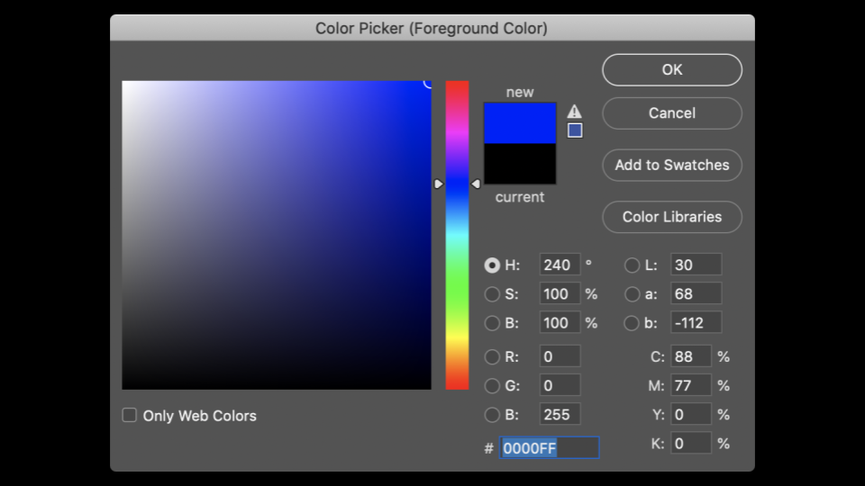

# Memory

* [Welcome!](#welcome)
* [Pixel Art](#pixel-art)
* [Hexadecimal](#hexadecimal)
* [Memory](#memory)
* [Pointers](#pointers)
* [Strings](#strings)
* [Pointer Arithmetic](#pointer-arithmetic)
* [String Comparion](#string-comparison)
* [Copying](#copying)
* [malloc and Valgrind](#malloc-and-valgrind)
* [Garbage Values](#garbage-values)
* [Pointer Fun with Binky](#pointer-fun-with-binky)
* [Swap](#swap)
* [Overflow](#overflow)
* [scanf](#scanf)
* [File I/O](#file-i/o)
* [Summing Up](#summing-up)

## Welcome

* In previous weeks, we talked about images being made of smaller buidling blocks called pixels.
* Today, we will go into further detail about the zeros and ones that make up these images. In particular, we will be going deeper inotu the fundamental building blocks that make up files, including images.
* Further, we will discuss how to access the underlying data stored in computer memory.

## Pixel Art

* Pixels are squares, individual dots, of color that are arranged on an up-down, left-right grid.
* You can imagine as an image as a map of bits, where zeros represent black and ones represent white.


* ***RBG***, or ***red***, ***green***, ***blue***, are numbers that represent the amount of each of these colors. In Adobe Photoshop, you can see thses settings as follows:



Notice how the amount of red, blue, and green changes the color selected.

* You can see by the image above that color is not just represented in three values. At the bottom oof the window, there is a special value made up of numbers and characters. 255 is represented as FF. Why might this be ?

## Hexadecimal

* ***Hexadecimal*** is a system of counting that has 16 counting values. They are as follows:
`0 1 2 3 4 5 6 7 8 9 a b c d e f`
Notice that F represents 15.
* Hexadecimal is also known as ***base-16***
* When counting in hexadecimal, each column is a power of 16.
* The number 0 is represented as `00`
* The number 1 is represented as `01`
* The number 9 is represented as `09`
* The number 10 is represented as `0A`
* The number 15 is represented as `0F`
* The number 16 is represented as `10`
* The number 2555 is represented as FF, because 16 X 15 (or F) is 240. Add 15 more to make 255. This is the highest number you can count using a two-digit hexadecimal system.
* Hexadecimal is useful because it can be represented using fewer digits. Hexadecimal allows us to represent information more succinctly.

## Memory

* In weeks past, you may recall out artist rendering of concurrent blocks of memory. Applying hexadecimal numbering to each of these blocks of memory, you can visualize these as follows:


* You can imagine how there may be confusion regarding whether the `10` block above may represent a location in memory or the value `10`. Accordingly, by convention, all hexadecimal numbers are often represented with the `0x` prefix as follows:


* In your terminal window, type `code addresse.c` and write your code as follows:

```C
#include <stdio.h>

int main(void)
{
    int n = 50;
    printf("%i\n", n);
}
```

Notice how `n`is stored in memory with the value 50.

* You can visualize how program stores this value as follows:


* The C language has two powerful operators that relate to memory:
`&` Prodide the address of something stored in memory.
`*` Instructs the compiler to go to a location in memory.
* We can leverage this knowledge by modifying our code as follws:

```C
#include <stdio.h>

int main(void)
{
    int n = 50;
    printf("%p\n", &n);
}
```

Notice how the `%p`, which allows us to view the address of a location in memory. `&n` can be literraly translated as "the address of `n`". Executing this code will return an address of memory beggining with `0x`.
Output:

```zsh
./addresses  
0x16ae7ef7c

```

## Pointers

* A ***pointer*** is a variable that contains the address of some value. Most succinctly, a pointer is an address in your computer's memory.
* Consider the following code:

```C
int n = 50;
int *p = &n;
```

Notice that `p` is a pointer that contains the address of an integer `n`.

* Modify your code as follows:

```C
#include <stdio.h>

int main(void)
{
    int n = 50;
    int *p = &n;
    printf("%p\n", p);
}
```

Notice that this code has the same effect as our previous code. We have simply leveragged our new knowledge of the `&` and `*` operators.

* To illustrate the use of the `*` operator, consider the following:

```C
#include <stdio.h>

int main(void)
{
    int n = 50;
    int *p = &n;
    printf("%i\n", *p);
}
```

Notice that the `printf` line prints the integer at the location of `p`. `int *p` creates a pointer whose job is to store the memory address of an integer.

* You can visualize our code as follows:


Notice the pointer seems rather large. Indeed, a pointer is usually stored as `8-byte value`. `p` is storing the address of the `50`.

* You can more accurately visualize a pointer as one address that points to another:


