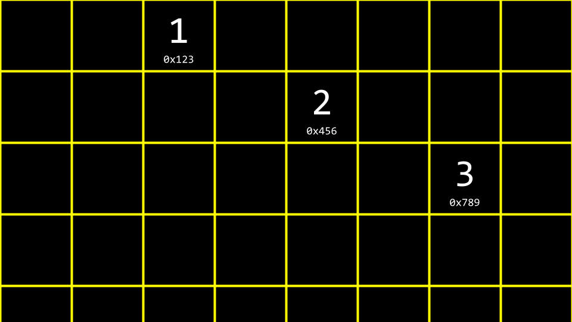

# Data Structures

* [Welcome!](#welcome)
* [Data Structures](#data-structure)
* [Stack and Queues](#stacks-and-queues)
* [Jack Learns the Facts](#jack-learns-the-facts)
* [Resizing Arrays](#resizing-arrays)
* [Linked Lists](#linked-lists)
* [Trees](#trees)
* [Dictionaries](#dictionaries)
* [Hashing and Hash Tables](#hashing-and-hash-tables)
* [Tries](#tries)
* [Summing Up](#summing-up)

## Welcome

* All the prior weeks have presented you with the fundamental building blocks of programming
* All you have learned in C will enable you to implement these building blocks in higher-level programming languages such as Python.
* Today, we are going to talk about organizing data in memory and design possibilities that emerge from your growing knowledge.

## Data Structures

* *Data structures*  essentially are forms of organization in memory.
* There are many ways to organize data in memory.
* *Abstract data structures* are those that we can conceptually imagine. When learning about computer science, it's often useful to begin with these conceptual data structures. Learning these will make it easier later to understand how to implement more concrete data structures.

## Stacks and Queues

* *Queues*  are one form of abstract data structure.
* Queues have specific properties. Namely, they are *FIFO* of "first in first out". You can imagine yourself in a line for a ride at an amusement park. The first person in the line gets to go on the ride first. The last person gets to go on the ride last.
* Queues have specific actions associated with them. For example, an item can be *enqueued* ; that is, the item can join them line or queue. Further, an item can be *dequeued*  or leave the queue once it reaches the front of the line.
* Queues contrast a *stack* . Fundamentally, the properties of a stack are different than a queue. Specifically, it is *LIFO* or "last in first out". Just like stacking trays in a cafetaria, a tray that is placed in a stack last is the first that may be picked up.
* Stacks have specific actions associated with them. For example, *push* places something on top of a stack. *Pop*  is removing something form the top of stack.
* In code, you might imagine s stack as follows:

```C
typedef struct
{
    person people[CAPACITY];
    int size;
}
stack;
```

Notice that an array called people is of type `person`. The `CAPACITY` is how hight the stack could be. The integer `size` is how full the stack actually is, regardless of how much it *could*  hold.

* You might imagine that the above code has a limitation. Sice the capacity of the array is always predetermined in this code. Therefore, the stack may always be oversized. You might imagine only using one place in the stack out of 5000.
* It would be nice for our stack to be dynamic - able to grow as items are added to it.

## Jack Learns the Fatcs

* We watched a video  called [Jack Learns the Facts](https://www.youtube.com/watch?v=ItAG3s6KIEI) by Professor Shanon Duvall of Elon University.

## Resizing Arrays

* Rewinding to Week 2, we introduced you to your first data structure.
* An array is a block of contiguous memory
* You might imagine an array as follows:


* In memory, there are other values being stored by other programs, functions, and variables. Many of these may be unused garbage values that were utilized at one point but available now for use.


* Imagine you wanted to store a fourth value `4` in our array? What would be needed is to allocate a new area of memory and move the old array to a new one. Initially, this new area of memory would be populated with garbage values.


* As values are added to this new area of memory, old garbage values would be overwritten.


* Eventually, all old garbage values would be overwritten with our new data.


* One of the drawbacks of this approach is that it's bad design: Every time we add a number, we have to copy the array item by item.
* Wouldn't it be nice if we able to put the `4` somewhere else in memory? By definition, this would no longer be an array because `4` would no longer be in contiguous memory.
* In your terminal, type `code list.c` ans write code as follows:

```C
// implements a list of numbers with an array of fixed size

#include <stdio.h>

int main(void)
{
    //List of size 3
    int list[3];

    // Initialize list with numbers
    list[0] = 1;
    list[1] = 2;
    list[2] = 3;

    for (int i = 0 ; i < 3; i++)
    {
        printf("%i\n", list[i]);
    }
}
```

Notice that the above is very much like what we learned earlier in this course. We have memroy being preallocated for three items.

* Building upon our knowledge obtained more recently, we can leverage our understanding of pointers to create a better design in this code. Modify your code as follows:

```C
#include <stdio.h>
#include <stdlib.h>

int main(void)
{
    //List of size 3
    int *list = malloc(3 * sizeof(int));
    if(list == NULL)
    {
        return 1;
    }

    // Initialize list with numbers
    list[0] = 1;
    list[1] = 2;
    list[2] = 3;

    // List of size 4
    int *tmp = malloc(4 * sizeof(int));
    if (tmp == NULL) {
        free(list);
        return 1;
    }

    // Copy list of size 3 into list of size 4
    for (int i = 0 ; i < 3; i++)
    {
        tmp[i] = list[i];
    }

    //Add number to list of size 4
    tmp[3] = 4;

    // Free list of size 3
    free(list);

    //Remember list of size 4
    list = tmp;

    //Print list
    for (int i =0; i < 4; i++) {
        printf("%i\n", list[i]);
    }

    // Free list
    free(list);
    return 0;
}
```

Notice that a list of size three integers is created. Then, three memory addresses can be assigned the values `1, 2, and 3`. Then, a list of size four is created. Next, the list is copied from the first to second. The value for the `4` is added to the `tmp` list. Since the block of memory that `list` points to is no longer used, it is freed using the command `free(list)`. Finally, the compiler is told to point `list` pointer now to the block of memory that `tmp` points to. The contens of `list` are printed and then freed.

* It's useful to think about `list` and `tmp` as both signs that point at a chunk of memory. As in the example above, `list` at one point *pointed*  to an array of size 3. By the end, `list` was told to point to a chunk of memory of size 4. Technically, by the end of the above code, `tmp` and `list` both pointed to the same block of memory.
* One may be tempted to allocate way more memory than required for the list, such as 30 items instead of the required 3 or 4. However, this is bad design as it taxes system resources when they are not potentially needed. Further, there is little guarantee that memory for move than 30 items will be needed eventually.

## Linked Lists

* In recent weeks, you have learned about three useful primitives. A `struct` is a data type that you can define yourself. A `.` in *dot notation* allows you to access variables inside that structure. The `*` operator is used to declare a pointer of dereference a variable.
* Today, you are introduced to the `->` operator. It is an arrow. This operator goes to an address and looks inside of a structure.
* A *linked list*  is one of the most powerful data structures within C. A linked list allows you to include values that are located at varying areas of memory. Further, they allow you to dynamically grow and shrink the list as you desire.
* You might imagine three values stored at three different areas of memory as follows:



* How could one stitch together these values in a list?
* We could imagine this data pictured above as follows:


* we could utilize more memory to keep track of where the next item is.


Notice that `NULL` is utilized to indicate that nothing else is *next* i the list.

* By convention, we could keep one more element in memory, a pointer, that keeps track of the first in the list.


* Abstracting away the memory addresses, the list would appear as follows:


* These boxes are called *nodes* . A *node* contains both an *item* and a pointer called *next*. In code, you can imagine a node as follows:

```C
typedef struct node
{
    int number;
    struct node *next;
}
node;
```

Notice that the item contained within this node is an integer called `number`. second, a pointer to a node called `next` is included, which will point to another node somewhere in memory.

* conceptually, we can imagine the process of creatring a linked list. First, `node *list` is declared, but it is of a garbage value.


* Next, a node called `n` is allocated in memory.


* Next, the `number` of node is assigned the value `1`.


* Next, the node's `next` filed is assigned `NULL`


* Next, `list` is pointed at the memory location to where `n` points. `n` and `list` now point to the same place.


* A new node is then created. Both the `number` and `next` field are both filled with garbage values.


* The `number` value of `n`'s node (the new node) is updated to 2.


* Also, the `next` field is updated as well to `NULL`.


* Most important, we do not want to lose our connection to any of these nodes lest they be lost forever. Accordingly, `n`'s `next` field is pointed to the same memory location as`list`


* Finally, `list` is updated to point at `n`. We now have a linked list of two items.


* To implement this in code, modify your code as follows:

```C
// Prepends numbers to a linked list, using while loop to print 
#include <cs50.h>
#include <stdio.h>
#include <stdlib.h>

typedef struct node 
{
    int number;
    struct node *next;
} node;

int main(int argc, char *argv[])
{
    //Memory for numbers
    node *list = NULL;

    //for each command lune argument
    for (int i = 1; i < argc; i++) {
        //convert argument to int
        int number = atoi(argv[i]);
        
        //allocate node for number
        node *n = malloc(sizeof(node));
        if(n == NULL){
            return 1;
        }
        n->number = number;
        n->next = NULL;

        //Prepend node to list
        n->next = list;
        list = n;
    }

    //print numbers
    node *ptr = list;
    while (ptr != NULL) {
        printf("%i\n", ptr->number);
        ptr = ptr->next;
    }

    ptr = list;
    while (ptr != NULL) {
        node *next = ptr->next;
        free(next);
        ptr = next;
    }
}
```

Notice that what the user inputs at the command line is put into the `number` field of a node called `n`, and then that node is added to the `list`. For example, `./list 1 2` will put the number `1` into the `number` field of a node called `n`, then put a pointer to `list` into the `next` field of the node, and then update `list` to point to `n`. That same process is repeated for `2`. Next, `node *ptr = list` creates a temporary variable that points at the same spot that `list` points to. The `while` prints what at the node `ptr` points to, and then updates `ptr` to point to the `next` node in the list. Finally, all the memory is freed.

* n this example, inserting into the list is always in the order of `O(1)`, as it only takes a very small number of steps to insert at the front of a list.
* Considering the amount of time required to search this list, it is in the order of `O(n)`, as in the worst case the entire list must always be searched to find an item. The time complexity for adding a new element to the list will depend on where that element is added. This illustrated in the examples below.
* Linked lists are not stored in a contiguous block of memory. They can grow as large as you wish, provided that enough system resources exist. The downside, however, is that memory is required to keep track of the list instead of the array. This is because for each element, you must store not just the value of the element, but also a pointer to the next node. Further, linked lists cannot be indexed into like is possible in an array because we need to pass through the first `n - 1` elements to find the location of the `n`th element. Because of this, the list pictured above must be linearly searched. Binary search, therefore, is not possible in a list constructed as above.
* Further, you could place numbers at the end of the list as illustrated in this code:

```C
// Implements a list of numbers using a linked list
#include <cs50.h>
#include <stdio.h>
#include <stdlib.h>

typedef struct node 
{
    int number;
    struct node *next;
} node;

int main(int argc, char *argv[])
{
    //Memory for numbers
    node *list = NULL;

    //for each command lune argument
    for (int i = 1; i < argc; i++) {
        //convert argument to int
        int number = atoi(argv[i]);
        
        //allocate node for number
        node *n = malloc(sizeof(node));
        if(n == NULL){
            return 1;
        }
        n->number = number;
        n->next = NULL;
        if (list == NULL) {
            //this node is the whole list
            list = n;
        }else {// if list has numbers already
            //iterate over nodes in list
            for (node *ptr = list; ptr != NULL; ptr = ptr->next) {
                if (ptr->next == NULL) {
                    ptr->next = n;
                    break;
                }
            }
        }
    }

    //print numbers
    for (node *ptr = list; ptr != NULL; ptr = ptr->next) {
        printf("%i\n", ptr->number);
    }

    // free memory
    node *ptr = list;
    while (ptr != NULL) {
        node *next = ptr->next;
        free(ptr);
        ptr = next;
    }
}
```

Notice how this code *walks down*  this list to find the end. When appending an element, (adding to the end of the list) our code will run in `O(n)`, as we have to go through our entire list before we can add the final element.

* Further, you could sort your list as items are added:

```C

// Implements a list of numbers using a linked list
#include <cs50.h>
#include <stdio.h>
#include <stdlib.h>

typedef struct node 
{
    int number;
    struct node *next;
} node;

int main(int argc, char *argv[])
{
    //Memory for numbers
    node *list = NULL;

    //for each command lune argument
    for (int i = 1; i < argc; i++) {
        //convert argument to int
        int number = atoi(argv[i]);
        
        //allocate node for number
        node *n = malloc(sizeof(node));
        if(n == NULL){
            return 1;
        }
        n->number = number;
        n->next = NULL;
        if (list == NULL) {
            //this node is the whole list
            list = n;
        }else if (n->number < list->number) {//if number belongs at beginning of list
            n->next = list;
            list = n;
        } else {//if number belongs later in list
            //iterate over nodes in list 
            for (node *ptr = list; ptr != NULL; ptr = ptr->next) {
                //if at end of list
                if (ptr->next == NULL) {
                    //append node
                    ptr->next = n;
                    break;
                } 

                if (n->number < ptr->next->number) {
                    n->next = ptr->next;
                    ptr->next = n;
                    break;
                } 
            }
        }
    }

    //print numbers
    for (node *ptr = list; ptr != NULL; ptr = ptr->next) {
        printf("%i\n", ptr->number);
    }

    // free memory
    node *ptr = list;
    while (ptr != NULL) {
        node *next = ptr->next;
        free(ptr);
        ptr = next;
    }
}
```

Notice how this list is sorted as it build. To insert an element in this specific order, our code will still run in `O(n)` for each insertion, as in the worst case we will have to look through all current elements.

## Trees

* *Binary search trees*  are another data structure that can be used to store data more efficiently such that it can be searched and retrieved.
* You can imagine a sorted sequence of numbers.


* Imagine then that the center value becomes the top of a tree. Those that are less than this value are placed to the left. Those values that are more than this value are to the right.


* Pointers can then be used to point to the correct location of each area of memory such that each of these nodes can be connected.


* In code, this can be implemented as follows:

```C
//implements a list of numbers as a binary search tree 
#include <stdio.h>
#include <stdlib.h>

//represents a node
typedef struct node 
{
    int number;
    struct node *left;
    struct node *right;
}
node;

void free_tree(node *root);
void print_tree(node *root);

int main(void)
{
    //tree of size 0
    node *tree = NULL;


    //Add number to list 
    node *n = malloc(sizeof(node));
    if (n ==NULL) {
        return 1;
    }

    n->number = 2;
    n->left = NULL;
    n->right = NULL;
    tree = n;

    n = malloc(sizeof(node));
    if (n == NULL) {
        free_tree(tree);
        return 1;
    }

    n->number = 1;
    n->left = NULL;
    n->right = NULL;
    tree->left = n;

    //Add number to list 
    n = malloc(sizeof(node));
    if(n == NULL){
        free_tree(tree);
        return 1;
    }

    n->number = 3;
    n->left = NULL;
    n->right = NULL;
    tree->right = n;

    //print tree
    print_tree(tree);
    return 0;
}

void free_tree(node *root)
{
    if(root == NULL)
    {
        return;
    }

    free_tree(root->left);
    free_tree(root->right);
    free(root);
}

void print_tree(node *root)
{
    if (root == NULL) {
        return;
    }

    print_tree(root->left);
    printf("%i\n", root->number);
    print_tree(root->right);
}
```

Notice this search function begins by going to the location of `tree`. Then, it uses recursion to search for `number`. The `free_tree` function recursively frees the tree. `print_tree` recursively prints the tree.

* A tree like the above dynamism that an array does not offer. It can grow and shrink as we wish.
* Further, this structure offers a search time of `O(logn)`

## Dictionaries

* *Dictionaries* are another data structure.
* Dictionaries, like actual book-form dictionaries that have a word and a definition, have a *key* and a *value*.
* The *holy grail*  of algorithmic time complexity is `O(1)` or *constant time*. That is, the ultimate is for access to be instantaneous.


* Dictionaries can offer this speed of access through hashing.

## Hashing and Hash Tables

* *Hashing* is the idea of taking a value and being able to output a value that becomes a shortcut to it later.
* For example, hashing *apple* may hash as a value of `1`, and *berry* may be hashed as `2`. Therefore, finding *apple* is as easy as asking the *hash*  algorithm were *apple* is stored. While not ideal in terms of design, ultimately, putting all *a*'s in one bucket and *b'*s in another, this concept of *bucketizing* hashed values illustrates how you can use this concept: a hashed value can be used to shortcut finding such a value.
* A *hash function* is an algorithm that reduces a larger value to something small and predictable. Generally, this function takes in an item you wish to add to your hash table, and returns an integer representing the array index in which the item should be placed.
* A *hash table* is a fantastic combination of both arrays and linked lists. When implemented in code, a hash table is an *array*  of *pointers*  to *nodes*.
* A hash table could be imagined as follows:


Notice that this is an array that is assigned each value of the alphabet.

* Then, at each location of the array, a linked list is used to track each value being stored there:


* *Collisions*  are when you add values to the hash table, and something already exists at the hashed location. In the above, collisions are simply appended to the end of the list.
* Collisions can be reduced by better programming your hash table and hash algorithm. You can imagine an improvement upon the above as follows:


* Consider the following example of a hash algorithm:


* This could be implemented in code as:

```C
#include <ctype.h>
unsigned int hash(const char *word)
{
    return toupper(word[0]) - 'A';
}
```

Notice how the hash function returns the value of `toupper(word[0]) - 'A'`

* You, as the programmer, have to make a decision about the advantages of using more memory to have a large hash table and potentially reducing search time or using less memory and potentially increasing search time.

## Tries

* *Tries* are another form of data structure.
* *Tries*  are always searchable in constant time.
* One downside to *Tries*  is that they tend to take up a large amount of memory. Notice that we need **26 X 4 = 104** `node`'s just to sotre *Toad* !
* *Toad*  would be stored as follows:


* *Tom*  would then be stored as follows:


* The downside of this structure is how many resources are required to use it.

## Summing Up

In this lesson, you learned about using pointers to build new data structures. Specifically, we delved into…

* Data structures
* Stacks and queues
* Resizing arrays
* Linked lists
* Dictionaries
* Tries

[Source: Week 5](https://cs50.harvard.edu/x/2024/notes/5/)
